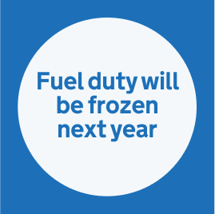

There are 3 'Inform Inspire' graphics on the brand guidelines site, all with slightly different config.

## Inform inspire scale



  
Web

  
App

  
Social



## Inform inspire with flex container, 2 `figure` items



Get help with...



Influencer/presenter



## Inform inspire with flex container, 5 items and list




