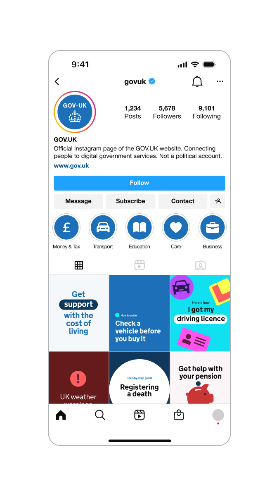
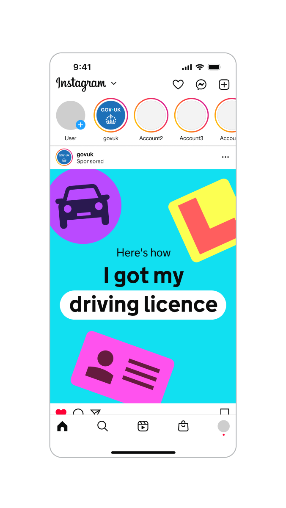
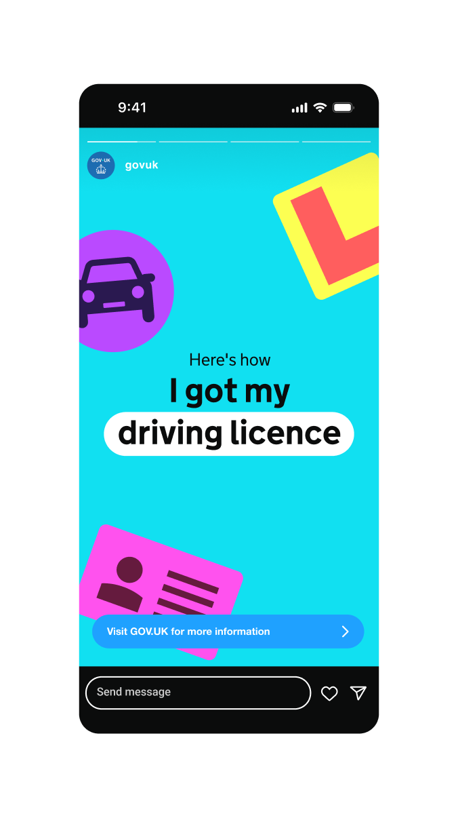
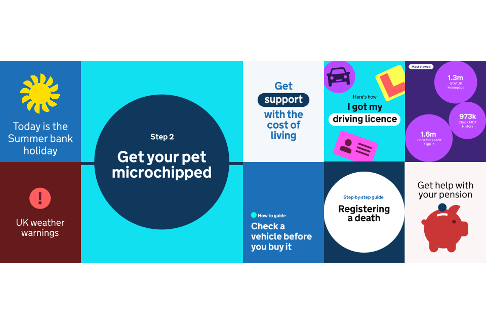
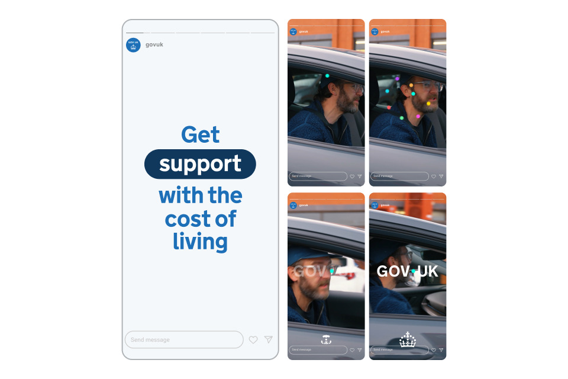


Indicative examples for illustrative purposes only.


## Social - Instagram





<!-- TODO: this is not a great description because Anika doesn't understand what this is -->

## Social - X

## Social - Instagram story

<!-- TODO: this will be a video, so the description needs to change and be underneath -->

## Social - YouTube

## Social - end frames

No audio. The dot leads a trail of other dots of various colours in a spiral towards the centre of a widescreen, where it becomes the dot within the GOV.UK logo as it fades and pushes in. The crown logo element is revealed by a circular iris effect at the bottom of the screen as the dots in the crown rise and fan out.


