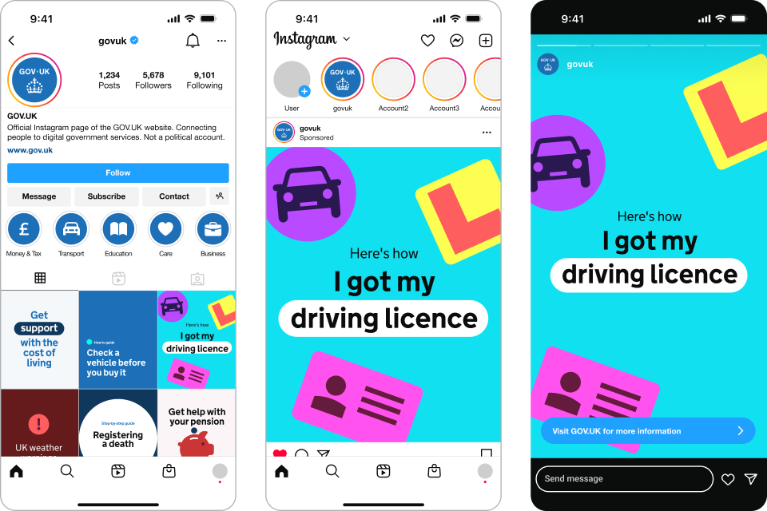
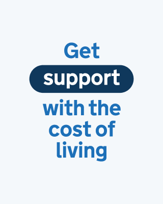
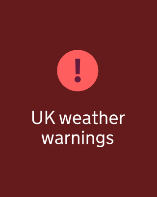
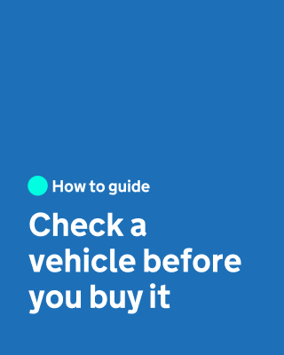
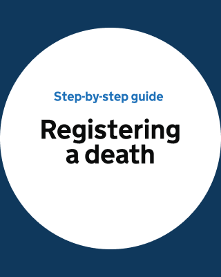
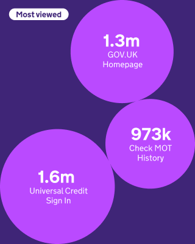
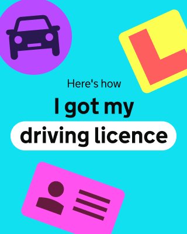
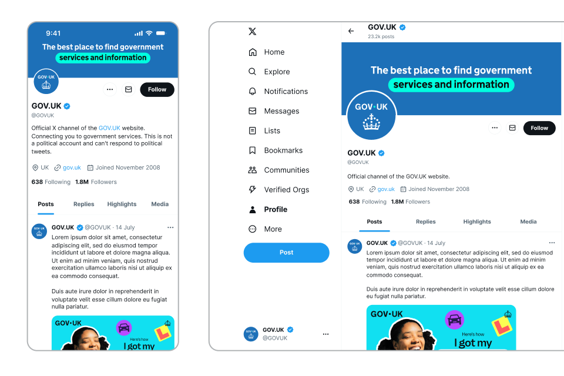
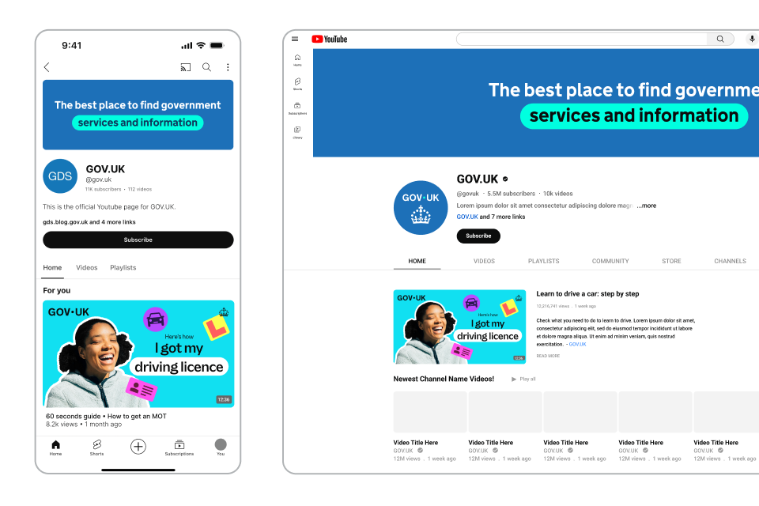

<!-- TODO: this needs some text on here, at least one introductory sentence -->


Indicative examples for illustrative purposes only.


## Social - Instagram































## Social - X





## Social - Instagram story

Short clip of people being interviewed on the street. The end of it is overlayed with the social end frame. (As below, dots in a spiral turn into the dot within the GOV.UK logo.)









## Social - YouTube

## Social - end frames

No audio. The dot leads a trail of other dots of various colours in a spiral towards the centre of a widescreen, where it becomes the dot within the GOV.UK logo as it fades and pushes in. The crown logo element is revealed by a circular iris effect at the bottom of the screen as the dots in the crown rise and fan out.


