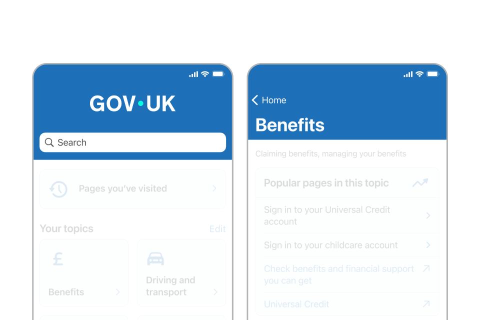

## App palette

The app palette contains all primary colours, tints, shades and accents.

[Follow the overall colour guidance](/colour/govuk-blue/) to ensure brand coherence across channels.

The app palette has:

- [blues](#blues)
- [greens](#greens)
- [teals](#teals)
- [purples](#purples)
- [magentas](#magentas)
- [reds](#reds)
- [oranges](#oranges)
- [yellows](#yellows)
- [neutrals](#neutrals)

### Blues



### Greens



### Teals



### Purples



### Magentas



### Reds



### Oranges



### Yellows



### Neutrals



## App header

For coherence with web, the app also uses the blue header throughout key screens. This also adds visual hierarchy and aids brand recognition.


Indicative examples for illustrative purposes only.


### Mobile web header

### App header


Indicative examples for illustrative purposes only.


## Examples

Within app we lead with the Primary blue and Accent teal, from splash screen to core components.

Where appropriate we can introduce harmonious colours to aid with structure and hierarchy of content – such as tints within cards or contextual colours that enhances navigation.

Colour should be applied in a way that does not add visual complexity or reduce accessibility.


Indicative examples for illustrative purposes only.


