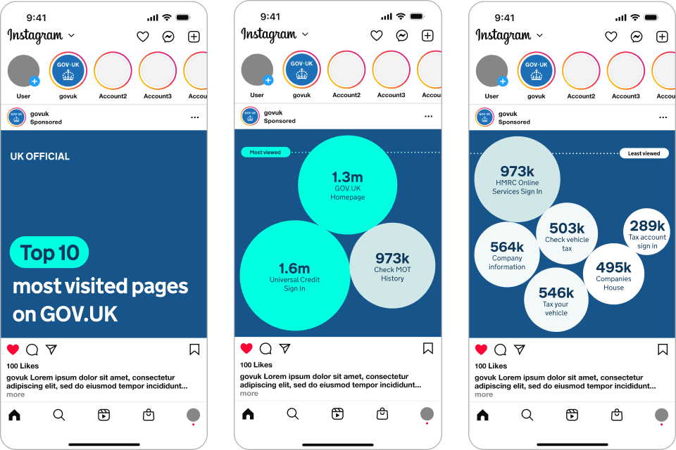

## Chart palette

In some charts, colours help differentiate between categories of data, such as in line charts or stacked bar charts. Some types of visualisations use colour to represent numerical values, such as heatmaps.

The chart palette has:

- [categorical colours](#categorical-palette)
- [blues](#blues)
- [magentas](#magentas)
- [reds](#reds)
- [greens](#greens)
- [purples](#purples)
- [teals](#teals)
- [oranges](#oranges)
- [neutrals](#neutrals)
- [additional colours](#additional-palette-for-illustrative-infographics)

{% set chartExtraColours = [
  { label: "Primary blue", hex: "#1D70B8", group: "categorical" },
  { label: "Blue shade 50%", hex: "#0F385C", group: "categorical" },
  { label: "Primary magenta", hex: "#CA357C", group: "categorical" },
  { label: "Purple tint 25%", hex: "#7F65B7", group: "categorical" },
  { label: "Teal tint 25%", hex: "#50A1A5", group: "categorical" },
  { label: "Orange tint 25%", hex: "#F7996A", group: "categorical" },
  { label: "Black tint 80%", hex: "#CECECE", group: "line" },
  { label: "Black", hex: "#0B0C0C", group: "label" },
  { label: "Blue tint 95%", hex: "#F4F8FB", group: "tint" },
  { label: "Magenta tint 95%", hex: "#FCF5F8", group: "tint" },
  { label: "Red tint 95%", hex: "#FCF5F5", group: "tint" },
  { label: "Green tint 95%", hex: "#F3F8F6", group: "tint" },
  { label: "Purple tint 95%", hex: "#F6F5FA", group: "tint" },
  { label: "Teal tint 95%", hex: "#F3F9F9", group: "tint" },
  { label: "Orange tint 95%", hex: "#FEF8F5", group: "tint" },
  { label: "Accent blue", hex: "#11E0F1", group: "accent" },
  { label: "Accent magenta", hex: "#FF52EE", group: "accent" },
  { label: "Accent red", hex: "#FF5E5E", group: "accent" },
  { label: "Accent green", hex: "#66F39E", group: "accent" },
  { label: "Accent purple", hex: "#BA4AFF", group: "accent" },
  { label: "Accent teal", hex: "#00FFE0", group: "accent" },
  { label: "Accent orange", hex: "#FFAF4A", group: "accent" }
] %}

### Categorical palette



#### Axes & lines



#### Labels



### Sequential and divergent scale palette

Avoid using colour alone to visualise insights. Use a maximum of two scales in a single chart.

#### Blues



#### Magentas



#### Reds



#### Greens



#### Purples



#### Teals



#### Oranges



#### Neutrals



### Additional palette for illustrative infographics

Must only be used in conjunction with backgrounds using 25% and 50% shades.




## Using colour in charts

When choosing colours for your data visualisation:

- ensure sufficient contrast with the background and overlapping text
- avoid using colour as the only visual means of conveying information
- focus on applying colour that enhances the clarity of the data
- limit colours to avoid confusion

{% set chartCategoryColours = [
  { label: "Primary blue", hex: "#1D70B8", group: "single" },
  { label: "Black tint 80%", hex: "#CECECE", group: "single" },
  { label: "Black", hex: "#0B0C0C", group: "single" },
  { label: "Blue shade 50%", hex: "#0F385C", group: "multiple" },
  { label: "Teal tint 25%", hex: "#50A1A5", group: "multiple" },
  { label: "Primary magenta", hex: "#CA357C", group: "multiple" },
  { label: "Orange tint 25%", hex: "#F7996A", group: "multiple" },
  { label: "Black tint 80%", hex: "#CECECE", group: "multiple" },
  { label: "Black", hex: "#0B0C0C", group: "multiple" },
  { label: "Primary red", hex: "#CA3535", group: "divergent" },
  { label: "Red tint 50%", hex: "#E59A9A", group: "divergent" },
  { label: "Black tint 80%", hex: "#CECECE", group: "divergent" },
  { label: "Blue tint 50%", hex: "#8EB8DC", group: "divergent" },
  { label: "Primary blue", hex: "#1D70B8", group: "divergent" },
  { label: "Black", hex: "#0B0C0C", group: "divergent" }
] %}





### Single category













### Multiple categories













### Divergent categories









## Using charts within social media

On social, charts can leverage the full colour palette. For example, accent colours can be used to highlight key data points and positive messages. We also use larger and bolder graphical elements to help engage and inform audiences.


Indicative examples for illustrative purposes only.

