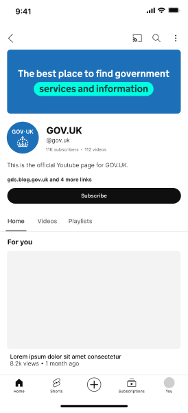
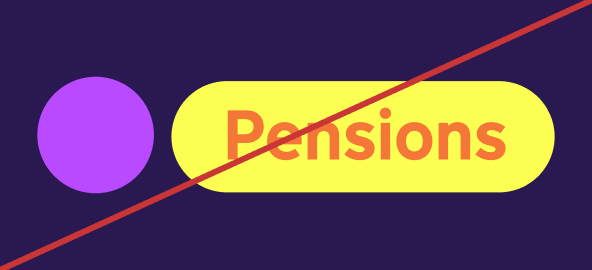

Our core brand colours are Primary Blue and Accent Teal.

We’re building on the primary blue already in place to support recognition and trust. Using it more consistently will make it a clear visual signature of GOV.UK.

Accent teal also sits alongside to add impact and help the brand feel more modern.

Primary Blue
RGB 29 112 184
#1D70B8

Accent Teal
RGB 0 255 224
#00FFE0

## Coherency across channels

We lead with the Primary Blue and Accent Teal across all GOV.UK channels. From the blue header on web and app, to branded banners within social platforms, this aids brand recognition and establishes trust.

### Mobile web header

### App splash screen

<!-- TODO: these files are partly duplicated in
logo system > app and graphic device > dot use examples -->
<!-- TODO: not sure if it should be ...-long.gif or ...-short.gif -->

### App header

### YouTube profile

Indicative examples for illustrative purposes only.

## Colour accessibility

You must make sure that the contrast ratio of colours used meets [Web Content Accessibility Guidelines (WCAG 2.2) success criterion 1.4.3 Contrast (minimum) level AA](https://www.w3.org/TR/WCAG22/#contrast-minimum).

## Incorrect colour usage

To maintain consistency across channels the colours within our palette should never be changed or altered. Exceptions to the recommendations below must be approved by the brand team.

Do not use colour combinations that do not meet [WCAG2.2 guidelines](https://www.w3.org/TR/WCAG22/#contrast-minimum)

Do not create new colours

Do not use too many colours within an application

Do not mix colours to create gradients (single colour gradients are permitted for use over imagery)

Indicative examples for illustrative purposes only.

## Tailoring for GOV.UK channels

Each GOV.UK channel requires a different level of function and expression and therefore the palette has been tailored accordingly.

The following guidance details which palette can be used across web, app and social.
