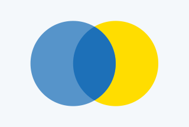



## Illustrations palette

Use the colour palette that matches the channel where the illustration will appear. For example, use the ‘Web’ palette for illustrations used on websites, and the ‘Social’ palette for illustrations used on social media platforms.
You can find these palettes in this colour section.

Wherever possible limit the number of colours used. Between four and six is a good rule of thumb, depending on the complexity of the illustration and the number of elements it includes.



### Applying colour





Primary blue is the basis of our brand and features heavily in our illustration work. Consider including ‘accent teal’ and ‘accent blue’ if they work with the specific illustration and its layout. They are both bold colours, but if used in the right way, for example to highlight a key component, they can enhance an image.



### Colour pairing





Choose colours that complement one another while providing enough contrast to distinguish key elements and maintain a clear visual hierarchy.





Using different shades of a colour can help to distinguish between the foreground and background. This can help prevent the overall image from looking too flat.





### Using contrast





Contrasting colours create visually appealing and accessible images.

Ensure the illustration is accessible by testing it with colour-blindness simulation tools. This helps confirm that no important information is lost or becomes difficult to distinguish for users with colour vision deficiencies.





In this example, the bright yellow and the blue shades create a clear focal point by using warm and cool contrasting colours. This highlights the action while keeping the GOV.UK brand identity dominant.




