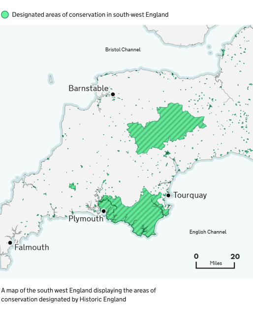

## Map palette

Use colour thoughtfully in maps, choose a clear palette, limit colours, and ensure a 3:1 contrast ratio. Check for colour-blind accessibility and include a legend.
Combine colour with shapes, patterns, and labels to improve clarity.

Be aware that users may interpret colours differently, influenced by cultural or political associations.

### Blues



### Magentas



### Reds



### Greens



### Purples



### Teals



### Oranges



### Neutrals



## Using colour combinations on maps

Avoid using colour alone to convey information in a map, instead use colour in combination with:

- using different shapes and symbols
- differentiating size and thickness of lines or shapes
- using labels
- creating a legend (‘key’) to explain what colours, tints and patterns mean

When you choose colours for a map, think about how they help users understand the information. The colours need to be clear, logical, and accessible.

Use colours that make sense to your users, and make sure there’s enough contrast between them. Text should also have strong contrast against the background so it’s easy to read.

Do not assume everyone sees colours the same way. Colour meanings can change depending on culture or context. For example, some colours are linked to political parties in the UK. Always test your map with users to check how they understand the colours.

If you cannot get enough contrast, try breaking the map into simpler versions, adding outlines to separate areas, or giving the same information in a different format, like written content or a postcode tool.

### Example

A map of the South West England displaying the areas of conservation designated by Historic England.


Indicative examples for illustrative purposes only.


### Colours used in example

{% set mapExampleColours = [
  { label: "Accent green", hex: "#66F39E", group: "poi" },
  { label: "Primary green", hex: "#11875A", group: "poi" },
  { label: "Black", hex: "#0B0C0C", group: "poi" },
  { label: "Black tint 80%", hex: "#CECECE", group: "base" },
  { label: "Black tint 95%", hex: "#F3F3F3", group: "base" },
  { label: "Teal tint 80%", hex: "#D0E6E7", group: "base" },
  { label: "Teal tint 95%", hex: "#F3F9F9", group: "base" }
] %}

#### Points of interest

Data is shown in Accent green and outlined in Primary green. Labels show nearby population centres in Black.



#### Base map

Land is shown in Black tint 95% and outlined in Black tint 80%.

Sea is shown in Teal tint 95% with coastal areas shown in Teal tint 80%.


