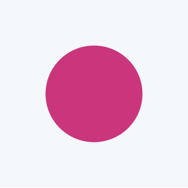
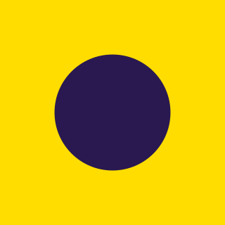
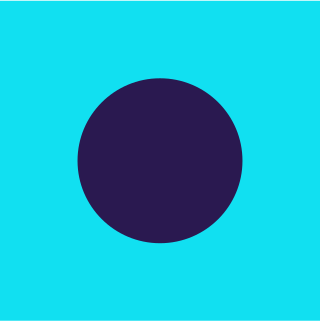
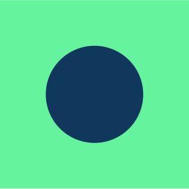
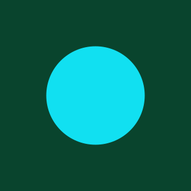
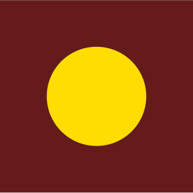

## Social palette

The social palette requires moments of increased brand expression and flex and therefore contains all primary colours, tints, shades and accents.

[Follow the overall colour guidance](/colour/govuk-blue/) to ensure brand coherence across channels.

The social palette has:

- [blues](#blues)
- [greens](#greens)
- [teals](#teals)
- [purples](#purples)
- [magentas](#magentas)
- [reds](#reds)
- [oranges](#oranges)
- [yellows](#yellows)
- [neutrals](#neutrals)

### Blues



### Greens



### Teals



### Purples



### Magentas



### Reds



### Oranges



### Yellows



### Neutrals



## Use colour to reflect tone

Our updated palette has been developed to allow a range in expression across the inform to inspire scale.

There are moments where the brand needs to feel functional and serious, guiding users seamlessly to the content and services they need. With the introduction of new channels such as social, there are also moments where the brand needs impact and visual differentiation.

Within our palette there are two approaches to colour application: tonal colours and companion colours.

Depending on tonal requirement, each can be used to achieve a different level of expression. The following guidance details the use of these two approaches.





### Tonal colour examples

Colour can be used to reflect tone of a message.

For more sensitive messaging, colours from within the same tonal range are used to feel more serious, informative and functional.


Indicative examples for illustrative purposes only.


{% set tonalColourExamples = [
  { label: "Green tint 95%", hex: "#F3F9F7", group: "example1" },
  { label: "Green shade 50%", hex: "#09442D", group: "example1" },
  { label: "Primary red", hex: "#CA3535", group: "example2" },
  { label: "Red shade 50%", hex: "#651B1B", group: "example2" },
  { label: "Accent red", hex: "#FF5E5E", group: "example2" },
  { label: "Purple tint 95%", hex: "#F6F5FA", group: "example3" },
  { label: "Primary purple", hex: "#54319F", group: "example3" },
  { label: "Purple shade 50%", hex: "#2A1950", group: "example3" },
  { label: "Accent purple", hex: "#BA4AFF", group: "example3" }
] %}



















## Companion colour set

Use companion colours when you need to emphasise something, like prompting action or sharing something positive. We’ve kept the set to 9 combinations to make sure they stay accessible.

Some pairings may be harder to see for people with visual impairments or colour blindness.

Choose combinations carefully and use a tool like [WhoCanUse.com](https://www.whocanuse.com/) to check they meet [WCAG 2.2 Contrast (Minimum) Level AA](https://www.w3.org/WAI/WCAG22/Understanding/contrast-minimum.html).

Do not rely on colour alone to show meaning, signal an action or prompt a response. For more detail, see [WCAG 2.2: Use of Colour (Level A)](https://www.w3.org/WAI/WCAG22/Understanding/use-of-color.html).

Remember, some users browse with high-contrast settings or dark mode. Colours may need to be adjusted to work in those contexts.

{% set companionColours = [
  { label: "Primary blue", hex: "#1D70B8", group: "set1" },
  { label: "Primary yellow", hex: "#FFDD00", group: "set1" },
  { label: "Magenta tint 95%", hex: "#FCF5F8", group: "set2" },
  { label: "Primary red", hex: "#CA3535", group: "set2" },
  { label: "Blue tint 95%", hex: "#F4F8FB", group: "set3" },
  { label: "Primary magenta", hex: "#CA357C", group: "set3" },
  { label: "Primary yellow", hex: "#FFDD00", group: "set4" },
  { label: "Purple shade 50%", hex: "#2A1950", group: "set4" },
  { label: "Accent blue", hex: "#11E0F1", group: "set5" },
  { label: "Purple shade 25%", hex: "#3F2577", group: "set5" },
  { label: "Accent green", hex: "#66F39E", group: "set6" },
  { label: "Blue shade 50%", hex: "#0F385C", group: "set6" },
  { label: "Green shade 50%", hex: "#09442D", group: "set7" },
  { label: "Accent blue", hex: "#11E0F1", group: "set7" },
  { label: "Primary blue", hex: "#1D70B8", group: "set8" },
  { label: "Accent blue", hex: "#11E0F1", group: "set8" },
  { label: "Red shade 50%", hex: "#651B1B", group: "set9" },
  { label: "Primary yellow", hex: "#FFDD00", group: "set9" }
] %}























































### Companion colour examples

Colour can be used to reflect tone of a message.

For more sensitive messaging, colours from within the same tonal range are used to feel more serious, informative and functional.


Indicative examples for illustrative purposes only.


{% set companionColourExamples = [
  { label: "Primary blue", hex: "#1D70B8", group: "example1" },
  { label: "Primary yellow", hex: "#FFDD00", group: "example1" },
  { label: "Primary magenta", hex: "#CA357C", group: "example2" },
  { label: "Blue shade 50%", hex: "#0F385C", group: "example2" },
  { label: "Magenta tint 95%", hex: "#FCF5F8", group: "example2" },
  { label: "Accent green", hex: "#66F39E", group: "example3" },
  { label: "Blue shade 50%", hex: "#0F385C", group: "example3" }
] %}


















