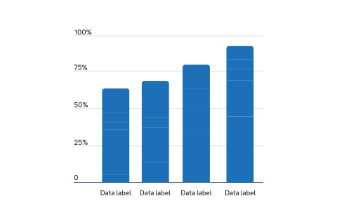
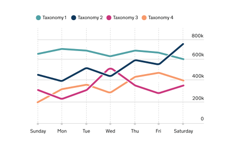
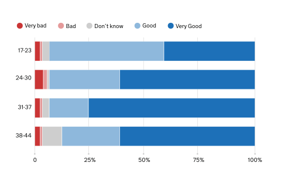
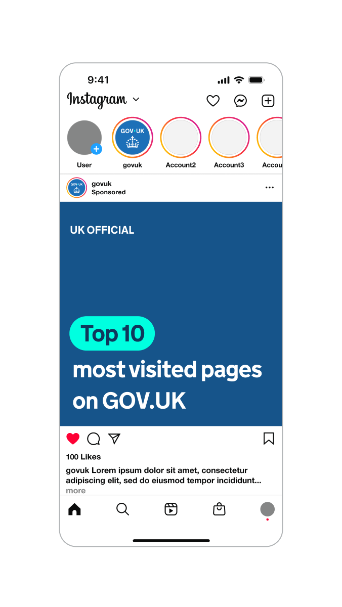
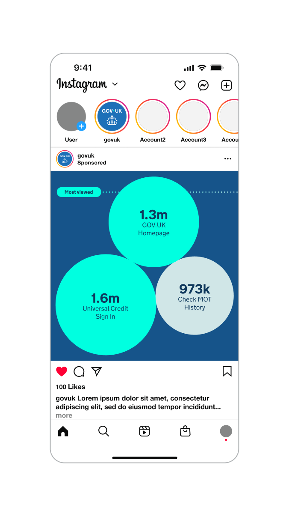
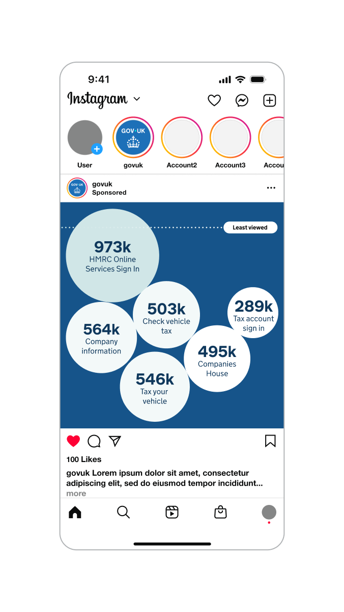

## Elements of a chart

Charts come in many forms, but most share the same anatomy. Understanding the basic building blocks behind a chart can help when creating one.

Graphical elements like the plot area, gridlines, marks and tick marks play an important role in helping the user understand and interpret the data in your chart.

The right axis scale helps convey the relative size of your data values accurately and clearly to the user.

Text in a chart is just as important in helping users understand the chart and the data it shows.

### Titles

All charts need at least one title, but it's considered best practice to also include a subtitle.

Titles should be:

- front-loaded
- in the active voice
- in sentence case
- describing the main trend
- as concise as possible

Subtitles should include the:

- statistical measure
- geographic coverage
- time-period

### Axes

Axes show what’s being measured in a chart such as time, quantity, or categories. Clear labels help users understand the data quickly.

Use axis titles to show units, but avoid repeating details from the chart title, subtitle, or annotations.

For percentages or money, include symbols like % or £ in the axis labels. For other units, place them in the axis title or subtitle — not the labels.

Category names should be short and clear. Simplify long labels to make charts easier to read and more accessible.

### Annotations

Keep annotations concise. Limit them to around 50 characters (about 10 to 12 words) and a single sentence.

Place annotations as close as possible to the part of the chart they relate to.

There should be white space between your annotation text and other text or parts of your chart. Make sure your annotation text does not overlap with other chart elements.

Make sure any essential information you include in annotations is also included in the main text or footnotes.

### Sources and footnotes

You should give the specific data source for each chart and link directly to it if you can.

It's best practice to provide source information in the following format:

[Publication, survey or other source of data] from the [organisation]

Footnotes should only be used to provide essential contextual information for a specific chart or table. They should be as clear and concise as possible.

Using too many footnotes can interrupt the flow of the publication.

## Chart palette

In some charts, colours help differentiate between categories of data, such as in line charts or stacked bar charts. Some types of visualisations use colour to represent numerical values, such as heatmaps.

{% set chartExtraColours = [
  { label: "Primary blue", hex: "#1D70B8", group: "categorical" },
  { label: "Blue shade 50%", hex: "#0F385C", group: "categorical" },
  { label: "Primary magenta", hex: "#CA357C", group: "categorical" },
  { label: "Purple tint 25%", hex: "#7F65B7", group: "categorical" },
  { label: "Teal tint 25%", hex: "#50A1A5", group: "categorical" },
  { label: "Orange tint 25%", hex: "#F7996A", group: "categorical" },
  { label: "Black tint 80%", hex: "#CECECE", group: "line" },
  { label: "Black", hex: "#0B0C0C", group: "label" },
  { label: "Blue tint 95%", hex: "#F4F8FB", group: "tint" },
  { label: "Magenta tint 95%", hex: "#FCF5F8", group: "tint" },
  { label: "Red tint 95%", hex: "#FCF5F5", group: "tint" },
  { label: "Green tint 95%", hex: "#F3F9F7", group: "tint" },
  { label: "Purple tint 95%", hex: "#F6F5FA", group: "tint" },
  { label: "Teal tint 95%", hex: "#F3F9F9", group: "tint" },
  { label: "Orange tint 95%", hex: "#FEF8F5", group: "tint" },
  { label: "Accent blue", hex: "#11E0F1", group: "accent" },
  { label: "Accent magenta", hex: "#FF52EE", group: "accent" },
  { label: "Accent red", hex: "#FF5E5E", group: "accent" },
  { label: "Accent green", hex: "#66F39E", group: "accent" },
  { label: "Accent purple", hex: "#BA4AFF", group: "accent" },
  { label: "Accent teal", hex: "#00FFE0", group: "accent" },
  { label: "Accent orange", hex: "#FFAF4A", group: "accent" }
] %}

### Categorical palette



#### Axes & lines



#### Labels



### Sequential and divergent scale palette

Avoid using colour alone to visualise insights. Use a maximum of two scales in a single chart.

#### Blues



#### Magentas



#### Reds



#### Greens



#### Purples



#### Teals



#### Oranges



#### Neutrals



### Additional palette for illustrative infographics

Must only be used in conjunction with backgrounds using 25% and 50% shades.




## Using colour in charts

When choosing colours for your data visualisation:

- ensure sufficient contrast with the background and overlapping text
- avoid using colour as the only visual means of conveying information
- focus on applying colour that enhances the clarity of the data
- limit colours to avoid confusion

{% set chartCategoryColours = [
  { label: "Primary blue", hex: "#1D70B8", group: "single" },
  { label: "Black tint 80%", hex: "#CECECE", group: "single" },
  { label: "Black", hex: "#0B0C0C", group: "single" },
  { label: "Blue shade 50%", hex: "#0F385C", group: "multiple" },
  { label: "Teal tint 25%", hex: "#50A1A5", group: "multiple" },
  { label: "Primary magenta", hex: "#CA357C", group: "multiple" },
  { label: "Orange tint 25%", hex: "#F7996A", group: "multiple" },
  { label: "Black tint 80%", hex: "#CECECE", group: "multiple" },
  { label: "Black", hex: "#0B0C0C", group: "multiple" },
  { label: "Primary red", hex: "#CA3535", group: "divergent" },
  { label: "Red tint 50%", hex: "#E59A9A", group: "divergent" },
  { label: "Black tint 80%", hex: "#CECECE", group: "divergent" },
  { label: "Blue tint 50%", hex: "#8EB8DC", group: "divergent" },
  { label: "Primary blue", hex: "#1D70B8", group: "divergent" },
  { label: "Black", hex: "#0B0C0C", group: "divergent" }
] %}

### Single category



### Multiple categories



### Divergent categories



## Using charts within social media

On social, charts can leverage the full colour palette. For example, accent colours can be used to highlight key data points and positive messages. We also use larger and bolder graphical elements to help engage and inform audiences.






Indicative examples for illustrative purposes only.


## Creating interactive visualisations

An interactive visualisation allows the user to change what the chart shows.

### When to use interactive visualisations

Only consider using an interactive visualisation where the most important information for the user cannot be clearly shown through a non-interactive chart.

Use interactive visualisations when:

- users are likely to be most interested in personalising their data such as seeing data about their local authority
- there is not a clear way of displaying data without interactivity
- there are several interests or narratives across different locations or categories

### Disadvantages of interactive visualisations

Interactive visualisation need the user to make a selection to see information. This may:

- make it more difficult for users to get messages
- hide the main messages from users

Interactive visualisations are also more complex and time consuming to produce. There may not always be enough resource to create an interactive chart.

If an interactive visual is not suitable, use charts that highlight the main points of interest or findings without needing user input. Consider using several small charts, known as small multiples, to avoid using too many categories in a single visualisation.

### Tips

Some platforms may only accept certain image sizes or file formats.

If you’re publishing on a platform or using a content management system, check for any existing recommendations.
