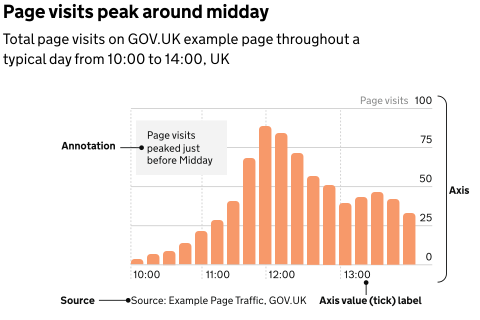

The [Colour: Charts](/colour/charts/) page shows the chart palette and how to use colour in charts, including charts in social media.

## Elements of a chart

Charts come in many forms, but most share the same anatomy. Understanding the basic building blocks behind a chart can help when creating one.

### Titles

All charts need at least one title, but it's considered best practice to also include a subtitle.

Titles should be:

- front-loaded
- in the active voice
- in sentence case
- describing the main trend
- as concise as possible

Subtitles should include the:

- statistical measure
- geographic coverage
- time-period

### Axes

Axes show what’s being measured in a chart such as time, quantity, or categories. Clear labels help users understand the data quickly.

Use axis titles to show units, but avoid repeating details from the chart title, subtitle, or annotations.

For percentages or money, include symbols like % or £ in the axis labels. For other units, place them in the axis title or subtitle — not the labels.

Category names should be short and clear. Simplify long labels to make charts easier to read and more accessible.

### Annotations

Keep annotations concise. Limit them to around 50 characters (about 10 to 12 words) and a single sentence.

Place annotations as close as possible to the part of the chart they relate to.

There should be white space between your annotation text and other text or parts of your chart. Make sure your annotation text does not overlap with other chart elements.

Make sure any essential information you include in annotations is also included in the main text or footnotes.

### Sources and footnotes

You should give the specific data source for each chart and link directly to it if you can.

It's best practice to provide source information in the following format:

[Publication, survey or other source of data] from the [organisation]

Footnotes should only be used to provide essential contextual information for a specific chart or table. They should be as clear and concise as possible.

Using too many footnotes can interrupt the flow of the publication.

## Creating interactive visualisations

An interactive visualisation allows the user to change what the chart shows.

### When to use interactive visualisations

Only consider using an interactive visualisation where the most important information for the user cannot be clearly shown through a non-interactive chart.

Use interactive visualisations when:

- users are likely to be most interested in personalising their data such as seeing data about their local authority
- there is not a clear way of displaying data without interactivity
- there are several interests or narratives across different locations or categories

### Disadvantages of interactive visualisations

Interactive visualisation need the user to make a selection to see information. This may:

- make it more difficult for users to get messages
- hide the main messages from users

Interactive visualisations are also more complex and time consuming to produce. There may not always be enough resource to create an interactive chart.

If an interactive visual is not suitable, use charts that highlight the main points of interest or findings without needing user input. Consider using several small charts, known as small multiples, to avoid using too many categories in a single visualisation.

### Tips

Some platforms may only accept certain image sizes or file formats.

If you’re publishing on a platform or using a content management system, check for any existing recommendations.
