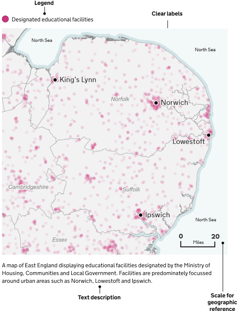

The [Colour: Maps](/colour/maps/) page shows the map palette and how to use colour combinations in maps.

## Elements of a map

A well designed map can bring data to life.
They can show geographical trends and patterns.

### Titles

All maps need at least one title, but it is considered best practice to give them two – a headline title and a formal statistical subtitle.

Titles should be:

- front-loaded
- in the active voice
- in sentence case
- describing the main trend
- as concise as possible

Subtitles should include the:

- statistical measure
- geographic coverage
- time-period

### Labels

If showing administrative boundaries, annotate them directly on the map or identify the boundary in the legend.

If only showing one or two features, we recommend labelling directly on the map.

This removes the need for a legend and free up space for other features.

### Legend

You can create a legend if it helps help make the map clearer and reduce clutter.

Place the legend in the top left corner, where people typically look first, and avoid overlapping features. Organise the legend from the most important data to the least important for easy understanding.

### Geographical features

Map features are the elements of a map that provide geographic context for the main data you’re showing. From bodies of water, terrain or boundaries, they help users understand where things are and how they relate to each other.

Keep your map simple. Remove any features that are not essential to the map’s message, like towns, roads, rivers, railways, pipelines or regional and country labels. If they do not add to the story or provide context to a user’s experience, feel free to leave them out.

### Source

You should give the specific data source for each map and link directly to it if you can.

It is best practice to provide source information in the following format:

[Publication, survey or other source of data] from the [organisation]

## Map considerations

A well-designed map should consider a few things.

### Hierarchy

Ensure the story is the foreground. The main story elements should be most prominent. Use bold colours with a larger font and symbol size on these elements.

Secondary features should fall to the background and not be as immediately present. Ensure there is enough contrast between background elements and other features.

### Remove extraneous features

Less is more. If features are not part of a story, feel free to thin out networks of line work or remove features that are not part of a story. This can include features such as roads, rivers, rails, pipelines and even country labels.

### Projections

Map projection parameters should strive to centre the focus area without bringing it too close to the neatline (the edge of the map).

Ask yourself: What is the map’s purpose and what is the best type of projection to depict it? What geographic extent will sufficiently support the spatial distribution of the story at the appropriate scale?

### Visualising scale

Scale bars are not always needed on a map, but are often helpful. If a map has anything to do with distance or shows features that a user would be curious how far apart they are, add a scale bar. If measuring distance is not helpful for the reader to understand the story, do not include one.

Scale bars are not always appropriate on all map projections (for example, Orthographic and Robinson). At global map extents for instance, scale bars are not as useful as the scale may vary significantly from one part of the map to another.

## Map accessibility

When you create maps, make sure they are accessible to everyone.

### Content

Every map should include a text description. This helps users who use screen readers understand what the map is visualising. If the map is simple, a short sentence may be enough. For more complex maps, include a longer explanation near the map or link to a separate page with more detail.

Use clear labels and ensure the structure of the page helps assistive technologies understand the content.

If the map includes important data, provide another way for users to access it, such as a table or written summary.

### Colour

Do not use colour as the only way to show differences on a map. People who are colour blind may not be able to tell certain colours apart.

Use patterns, shapes or clear labels alongside colour to help visualise the data to users.

Make sure there is enough contrast between background colours, lines, labels and any shaded areas.

Good colour contrast helps people with low vision and people using screens in different lighting conditions.

### Test

When you can, test your maps with people who use screen readers or other assistive technologies. This helps you find problems and make improvements based on real needs.

### Example

