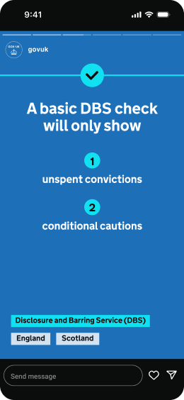
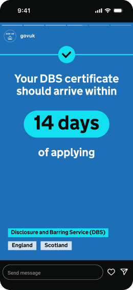
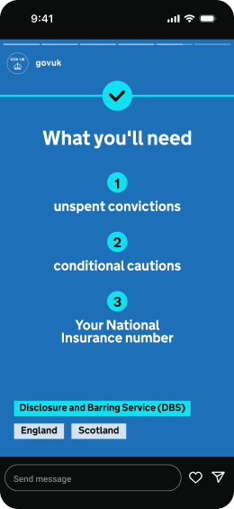
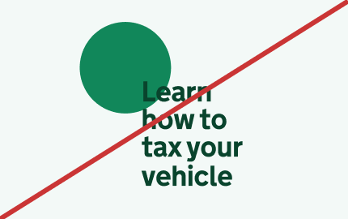
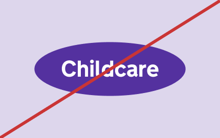

## App splash screen

The app splash screen utilises the dot in motion to represent GOV.UK bringing together government services and departments, all in one place.

<!-- TODO: these files are partly duplicated in
logo system > app and colour > palette overview -->

### App splash screen (long version)

### App splash screen (short version)

## Illustration

The dot can be brought to life through animation in illustrations, adding personality and expression to moments such as app onboarding, or to tell visual stories within social.

Person

TODO: missing video

Travel

TODO: missing video

Lock

TODO: missing video

Onboarding

TODO: missing video

Piggy bank

TODO: missing video

## Social media

Within the context of social media, strong brand expression and impact are essential for capturing attention and driving engagement. With content competing for visibility, our brand needs to stand out through more impactful visuals and dynamic motion.

To ensure consistency across all content, our dot graphic language should serve as a unifying anchor, reinforcing brand recognition and cohesion.

The dot provides a distinctive, flexible visual thread that ties together different content types, ensuring our brand remains instantly recognisable across content, thumbnails and profiles.

### Social end frames

To build coherence across channels, our social end frames follow the same motion behaviour as the app splash screen.

### Video end frame 16:9

<!-- TODO: these files are duplicated in logo system > social -->

### Video end frame 9:16

### Video end frame 1:1

## Video thumbnails

We can build on our dot graphic language to create engaging thumbnails that encourage user interaction.

Dot behaviours provide flexibility in how thumbnails can be created for a variety of content types, across a scale from informing to inspiring.

Thumbnails should always use the dot in a purposeful way. See examples of dot use within indicative thumbnails below.

<!-- Obviously, that's not the right heading, needs proper design -->

From most infomative to most inspiring

<!-- TODO: These images are all out of date and low res, so need to be replaced -->

Inform






Inspire

Indicative examples for illustrative purposes only.

## Static dot examples

The dot can also be used as a static graphic, adding emphasis and helping guide users through content.

<!-- TODO: Half of these images are out of date and they're all low res, so need to be replaced -->

   

Indicative examples for illustrative purposes only.

## Static dot storyboard

While it's important to use the dot in a purposeful way, it can effectively guide user attention and break down information to enhance the overall experience.
Such as in the instagram story below;

     

Indicative examples for illustrative purposes only.

## Incorrect dot usage

The dot has defined roles and behaviours, set out earlier in this guidance. To keep things consistent, avoid the following:

### Overuse

Dot not overuse the dot

### Decorative elements

Dot not use the dot in a decorative way

### Distortions

Do not distort or skew the dot

### Stroke

Do not use stroke versions of the dot

### Crops

Do not use abstract crops of the dot

### Unapproved filters and effects

Do not apply shadows or gradients

