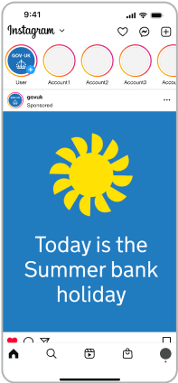
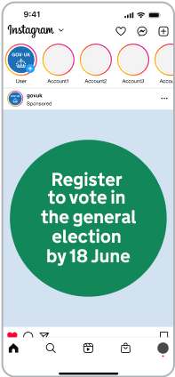
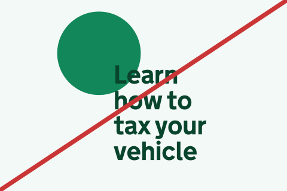

## App splash screen

The app splash screen utilises the dot in motion to represent GOV.UK bringing together government services and departments, all in one place.



    
 ### App splash screen (long version)



### App splash screen (short version)





### Video description

No audio. The dot leads a trail of other dots of various colours in a spiral towards the centre of a mobile screen, where it becomes the dot within the GOV.UK logo as it fades and pushes in. The crown logo is revealed by an circular iris effect at the bottom of the screen.

## Illustration

The dot can be brought to life through animation in illustrations, adding personality and expression to moments such as app onboarding, or to tell visual stories within social.



    
    ### Person

    No audio. An animation of a person giving a friendly wave. Circles are used to draw the head and hand, whilst pieces of a circle are used to draw the shoulders and hairstyle.
    
    
    
    
    
    ### Travel

    No audio. An animation of luggage moving aross the frame. Suitcases are drawn as rectangles with corners. Circles are used to draw wheels and luggage tags, whilst pieces of a circle are used to draw the handles.
    
    
    
    
    
    ### Lock

    No audio. An animation of a circle-shaped padlock opening and closing.
    
    
    
    
    
    ### Onboarding

    No audio. Animation of various circle-themed icons, including a speech bubble, notification bell, map pin and toggle switch.
    
    
    
    
    
    ### Piggy bank

    No audio. Animation of a circle-shaped piggy bank. Several coins drop into the piggy bank before it does a happy shake.
    
    
    
    



## Social media

Within the context of social media, strong brand expression and impact are essential for capturing attention and driving engagement.

With content competing for visibility, our brand needs to stand out through more impactful visuals and dynamic motion.

To ensure consistency across all content, our dot graphic language should serve as a unifying anchor, reinforcing brand recognition and cohesion.

The dot provides a distinctive, flexible visual thread that ties together different content types, ensuring our brand remains instantly recognisable across content, thumbnails and profiles.

### Social end frames

To build coherence across channels, our social end frames follow the same motion behaviour as the app splash screen.



### Video end frame 16:9

No audio.







### Video end frame 9:16

No audio.



### Video end frame 1:1

No audio.





## Video thumbnails

We can build on our dot graphic language to create engaging thumbnails that encourage user interaction.

Dot behaviours provide flexibility in how thumbnails can be created for a variety of content types, across a scale from informing to inspiring.

Thumbnails should always use the dot in a purposeful way.


Indicative examples for illustrative purposes only.




Get help with...


Influencer/presenter



## Static dot examples

The dot can also be used as a static graphic, adding emphasis and helping guide users through content.


Indicative examples for illustrative purposes only.




 

 

 



## Static dot storyboard

While it's important to use the dot in a purposeful way, it can effectively guide user attention and break down information to enhance the overall experience.


Indicative examples for illustrative purposes only.











## Incorrect dot usage

The dot has defined roles and behaviours, set out earlier in this guidance.

To keep things consistent, avoid the following:




    ### Overuse

    Do not overuse the dot

    
    
    

    ### Decorative elements

    Do not use the dot in a decorative way

    
    
    

    ### Distortions

    Do not distort or skew the dot

    
    
    

    ### Stroke

    Do not use stroke versions of the dot

    
    
    

    ### Crops

    Do not use abstract crops of the dot

    
    
    

    ### Filters and effects

    Do not apply shadows or gradients

    
    


