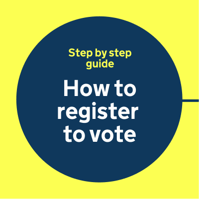

## The dot is a guide and companion

The dot can take on different roles – guiding users through content, journeys and experiences across GOV.UK channels.

It should always serve a clear purpose.

The examples on this page are indicative and for illustrative purposes only.

Guides

Highlights

Illustrates

Informs

Indicative examples for illustrative purposes only.

## Dot motion behaviours

Motion adds energy to our brand, especially when we need to capture attention or guide the user.

The examples below show how the dot takes on different roles through motion.

Guides

TODO: missing video

Navigates

TODO: missing video

Highlights

TODO: missing video

Informs

TODO: missing video

Transitions

TODO: missing video

Illustrates

TODO: missing video