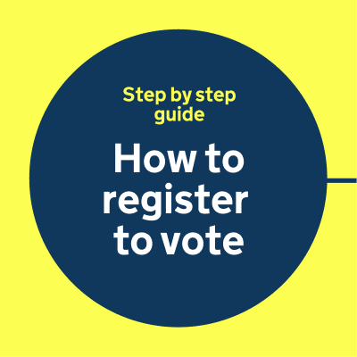
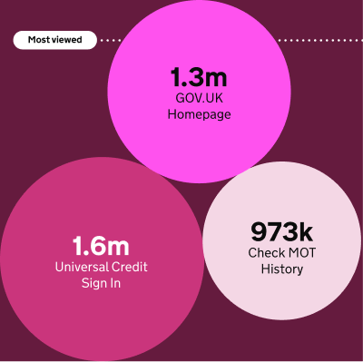

## The dot is a guide and companion

The dot can take on different roles – guiding users through content, journeys and experiences across GOV.UK channels.

It should always serve a clear purpose.

The examples on this page are indicative and for illustrative purposes only.



### Guides

### Highlights

### Illustrates

### Informs



Indicative examples for illustrative purposes only.

## Dot motion behaviours

Motion adds energy to our brand, especially when we need to capture attention or guide the user.

The examples below show how the dot takes on different roles through motion.



### Guides

<video src="./expression-dot-guides.mp4" controls width="720" style="max-width: 100%" class="govuk-!-padding-bottom-3">
This video does not contain any audio.
</video>

The dot moves playfully from left to right, pausing briefly at points to show numbered steps from 1 to 4.

### Navigates

<video src="./expression-dot-navigates.mp4" controls width="720" style="max-width: 100%" class="govuk-!-padding-bottom-3">
This video does not contain any audio.
</video>

The dot moves in a straight line from left to right across a navigation list of topics, pausing briefly underneath each topic to push it above the others.

### Highlights

<video src="./expression-dot-highlights.mp4" controls width="720" style="max-width: 100%" class="govuk-!-padding-bottom-3">
This video does not contain any audio.
</video>

The dot is shown at the end of a "Don't forget to vote" message as it transforms into a lozenge shape to highlight "vote".

### Informs

<video src="./expression-dot-informs.mp4" controls width="720" style="max-width: 100%" class="govuk-!-padding-bottom-3">
This video does not contain any audio.
</video>

The small dot with a label showing 1% starts growing whilst the percentage label steadily increases up to 35%. Then, the dot continues to grow and cover the entire screen until the percentrage reaches 100%.

### Transitions

<video src="./expression-dot-transitions.mp4" controls width="720" style="max-width: 100%" class="govuk-!-padding-bottom-3">
This video does not contain any audio.
</video>

The dot shown in a title card, where it's the dotted "i" in "Childcare". The dot expands to cover the entire screen, to transition to a second title card with a message to "Apply for 30 hours of government funded childcare"

### Illustrates

<video src="./expression-dot-illustrates.mp4" controls width="720" style="max-width: 100%" class="govuk-!-padding-bottom-3">
This video does not contain any audio.
</video>

The dot swiftly moves like a drawing cursor to draw a simple icon of a circle with a tick.


