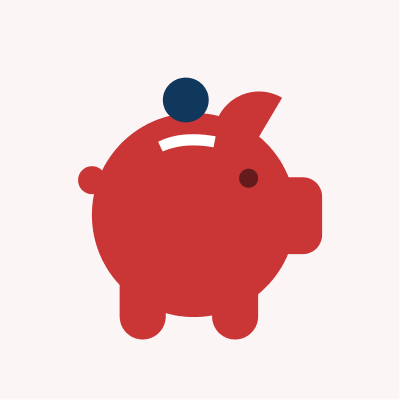

## The dot is a guide and companion

The dot can take on different roles – guiding users through content, journeys and experiences across GOV.UK channels.

It should always serve a clear purpose.


The examples on this page are indicative and for illustrative purposes only.




### Guides

### Highlights

### Illustrates

### Informs



## Dot motion behaviours

Motion adds energy to our brand, especially when we need to capture attention or guide the user.

The examples below show how the dot takes on different roles through motion.



### Guides

No audio. The dot moves playfully from left to right, pausing briefly at points to show numbered steps from 1 to 4.



### Navigates

No audio. The dot moves in a straight line from left to right across a navigation list of topics, pausing briefly underneath each topic to push it above the others.



### Highlights

No audio. The dot is shown at the end of a "Don't forget to vote" message as it transforms into a lozenge shape to highlight "vote".



### Informs

No audio. The small dot with a label showing 1% starts growing whilst the percentage label steadily increases up to 35%. Then, the dot continues to grow and cover the entire screen until the percentrage reaches 100%.



### Transitions

No audio. The dot shown in a title card, where it's the dotted "i" in "Childcare". The dot expands to cover the entire screen, to transition to a second title card with a message to "Apply for 30 hours of government funded childcare"



### Illustrates

No audio. The dot swiftly moves like a drawing cursor to draw a simple icon of a circle with a tick.




