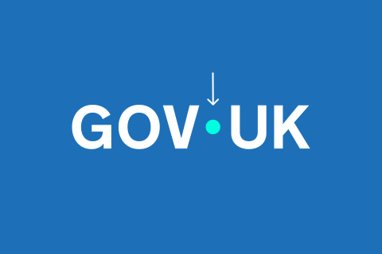

## The Dot

Our dot is the bridge between government and the UK, by the side of users to help make information and services easier and more useful.

Used within our wordmark and as a graphic device across all GOV.UK channels, the dot is a guiding hand, for life.

<!-- TODO: this is not the final MP4 file
but it's good to have one file to see and play around with the video player -->

<video src="./dot-animations.mp4" controls width="720"></video>

Indicative examples for illustrative purposes only.
