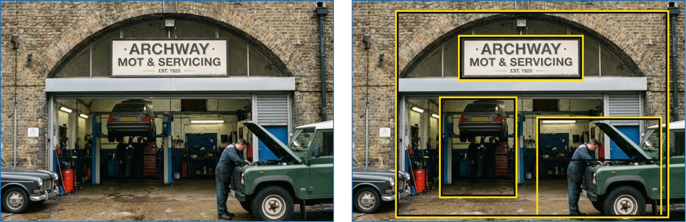
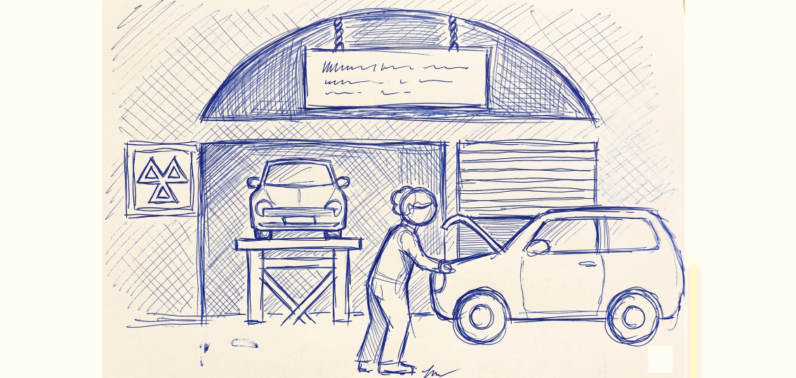
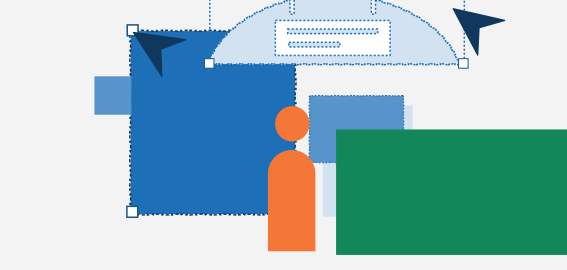
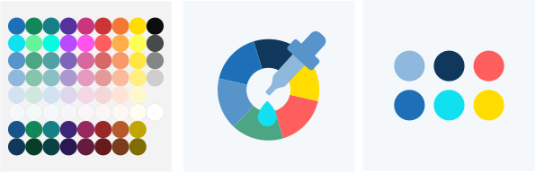

## 1. Gather research and reference

Start by gathering image reference sources that help you understand the layout/composition of the scene.

Focus on:

- Overall structure and balance
- Foreground/mid-ground/background relationships
- Framing devices or background shapes
- Scale and positioning of key elements

The second image below highlights the key details that make the scene easy to read. Avoid getting distracted by stylistic elements and focus on the core visual information that communicates the scene clearly.

For reference, ‘Artificial Intelligence’ images have been used in this example. It is recommended to use real images instead.

## 2. Sketch the concept

Create a rough sketch that defines the overall composition.

- Block in large shapes first
- Illustrations can be sparse, for example one or two elements or more complex layered scenes, depends on context
- Identify the main action and supporting elements
- Ensure the focal point is clear
- Test how the image reads quickly at a glance
- Focus on clarity and hierarchy

## 3. Simplify the forms

Reduce all elements to their simplest, most recognisable shapes.

- Use flat colour and a 2D perspective
- Build objects from geometric shapes and where possible include the dot
- Use smooth curves rather than organic or messy shapes
- Illustration should be minimal in style, but the narrative and composition can include multiple illustrative elements

## 4. Build the composition

This is the editing phase where you decide what you want to eliminate, simplify and keep.

- Apply blocks of colour to distinguish layers and organise the composition
- Create a sense of depth using simple layering, and avoid trying to draw a realistic 3D perspective.
- Allow elements to break the edge of the frame to create dynamism and suggest movement
- Remove unnecessary details so the action remains clear and readable. Experiment with scale, shape, and color contrast to create a stronger composition and add visual interest.

## 5. Creating characters

- Characters use geometric forms - circular heads and hands, rounded rectangular bodies, smooth curved arms, and no facial features.
- A broad and respectful range of diversity should be shown across skin tones, ages, body types, visible abilities, and hairstyles.
- Read the [characters page](../characters/) for more guidance on how to create characters.

## 6. Establish visual hierarchy

Create an image that a viewer will be able to read and understand:

- Adjust scale so important elements are larger
- Use of empty space to separate foreground and background
- Use colour contrast to draw attention to key elements

## 7. Consider colour

When creating a composition, use a refined selection of 4 to 6 colours rather than the full colour palette. Please refer to the colour section of the brand guidelines for more information.

- Establish a dominant colour: designate one clear lead colour (prioritising GOV.UK primary blue) supported by its shades to create depth and highlights
- Create contrast: introduce a couple accent/primary colours to direct the eye and highlight the main action

## 8. Review for clarity and consistency

Check that the illustration:

- Reads clearly at small and large sizes
- Uses consistent shapes, curves, and colour application
- Avoids unnecessary detail or decoration
- Aligns with the GOV.UK illustration style principles
- Adopts colours from the appropriate GOV.UK colour palette

