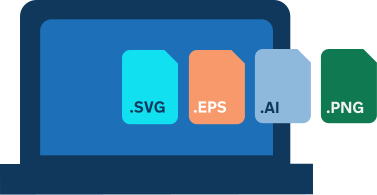

Create vector illustration assets with source files saved in their own native or open formats.

Deliverables may include .EPS, .SVG, .AI, .PNG depending on the intended use. A distinction should be made between deliverables for internal teams and contractors (i.e. source images) versus deliverables for users. For example a user should never see an .EPS or .AI file from us.

We are also building an archive of illustrative assets that will soon be available to adapt or re-contextualise in any new illustrations. For access contact the team at [govuk-brand-team@dsit.gov.uk](mailto:govuk-brand-team@dsit.gov.uk).

## Need help?

If your service is part of the [GOV.UK Proposition](https://www.gov.uk/government/publications/govuk-proposition/govuk-proposition) and you have a question about our illustration guidelines, contact the team at [govuk-brand-team@dsit.gov.uk](mailto:govuk-brand-team@dsit.gov.uk).
