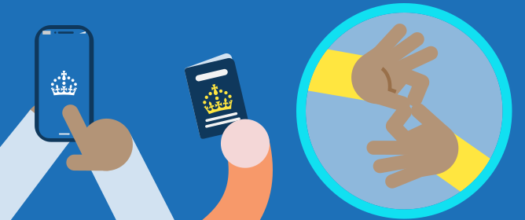

Represent hands as simple circles by default. When an interaction requires specific clarity, such as depicting sign language, you may include simplified fingers, a thumb, and a subtle palm line to define the orientation of the hand. Restrict these details to scenarios where they are essential for the user to recognise the gesture.


British Sign Language sign for “connection” shown above.


## Hands primarily serve two functions

- **Gestural**: Demonstrating actions such as shaking hands, holding, or presenting an object.

- **Directional**: Indicating interaction with technology (for example, using a touchscreen or keyboard) or pointing to specific elements.

If a close-up image features a device (laptop, phone, etc.), ensure a character's presence is maintained by showing hands interacting with the device.

For improved composition, crop the arm as illustrated above, using the screen/canvas edge or solid background colours to define the boundaries.
