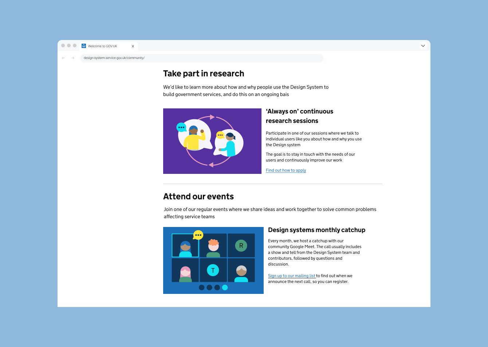
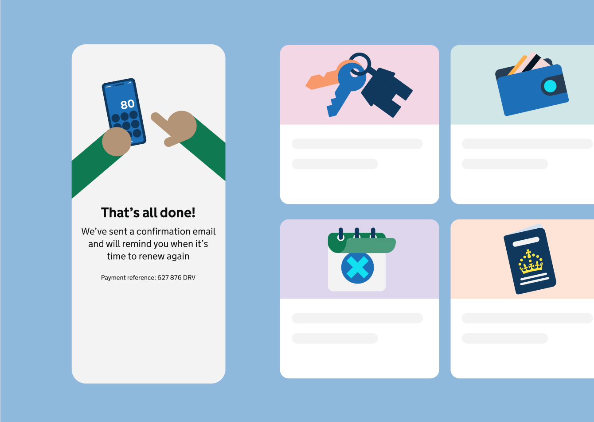

These examples show how GOV.UK illustrations remain consistent and coherent across GOV.UK web, app, and social media channels.

## Web

## App


Indicative examples for illustrative purposes only.


## Socials

![A screenshot of the official GOV.UK Instagram account landing page. It displays the GOV.UK logo mark, information about the number of posts and followers, and three illustrations. The first illustration is a yellow sun on a blue sky with the caption 'Today is the summer bank holiday'. The second illustration is a passport with the caption 'Tips for taking a passport photo.' The third illustration shows icons of a car, a learner driver plate and the licence itself with the caption 'Here's how I got my driving licence'.](social-illustration-example.png)


Indicative examples for illustrative purposes only.

