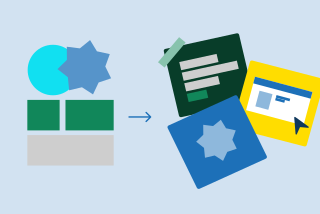
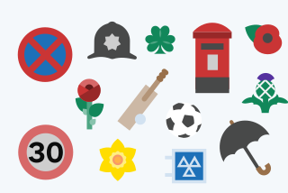

Our illustration style follows six key principles:





### Use flat colour and geometric shapes

Use flat colour, focussing on circles derived from the dot and other geometric shapes, to create simple forms, or combine them to produce complex imagery.









### Keep the level of detail minimal

Limit the level of detail so that the imagery works at small and large scale. We don't include facial features so that the focus is more on the scene overall and not individual characters' facial expressions.









### Use curved and square corners

Balance the use of rounded and square corners. We use both which helps things look more visually pleasing and aids the recognisability of images.









### Use subtle layering

Overlap elements to create depth and harmony. Use layering to highlight key elements as well as making images easier to comprehend.









### Use a slightly restricted colour palette

To bring a sense of unity to our illustrations, we tend to work with 4-6 colors from our palette plus their associated shades and tints. Always use the specific color palette that matches the channel where the illustration will appear. Try to include the primary blue as a foundation, using the accent teal to highlight key elements and focal points.









### Use contrasting colour and tones

Use contrasting colours or tones, and a combination of warm and cool colours. This is both more visually appealing and accessible.









## Style and approach

The main focus should be on messaging and storytelling and finding the most relatable aspect of any process or topic you want to illustrate. As a starting point, there are three questions that should be asked as outlined below.





### Single or multi-image illustration?

We can use single image illustrations to encompass everything in one scene, or a series of panels to tell a story or highlight the different stages in a process.









### Is it character led?

If human characters are featured, show them in the process of doing things and interacting with each other: for example carrying something together or shaking hands.









### Is it information led?

When illustrations need to be more instructional, the focus should be on highlighting processes rather than characters. Examples include demonstrating navigation through a specific part of the GOV.UK site or app, or emphasising data. For illustrations where data is the key part, refer to the visualising data section of the guidelines.












### Remember to include relatable details

To create familiarity and authenticity, incorporate design elements that are specific to the UK.








## Inform vs. inspire

Illustration can be used in different ways depending on the subject matter and where it will be seen. It may make more sense to use imagery that directs and informs a viewer rather than it having an emotive quality that looks to engage and inspire.

Where will your illustration fit best on this scale?



Process involved in completing the task


Telling a story


