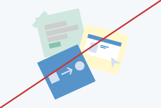
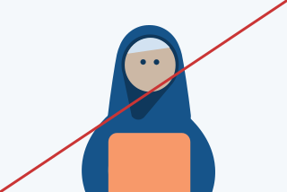
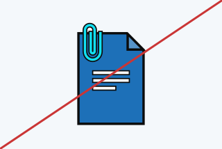
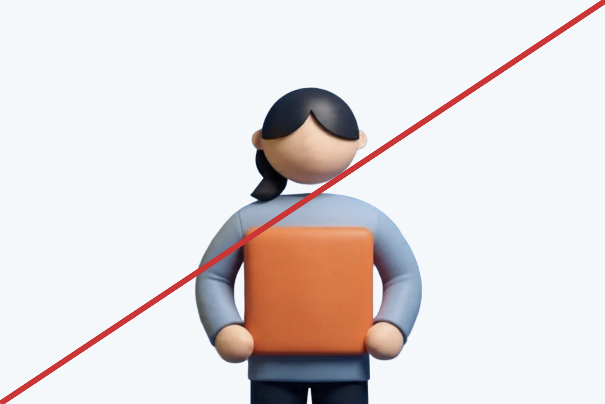

Our illustration style is guided by a set of principles outlined earlier in this guidance. To keep illustrations consistent, avoid the following:



Don’t use gradients.

Don’t use patterns.

Don’t use low contrasting colours.

Don’t add facial expressions to characters.

Don’t use outlines or strokes.

Don’t use three dimensional assets, However, layering of 2D assets to create a sense of depth is allowed.




Artificial intelligence image used in the example above.


## Incorrect contextual usage

- Don’t include imagery that is of a sensitive nature.
- Don’t create purely decorative illustrations.
- Don’t use humour or satire.
- Avoid assumptions about gender, age, disability, ethnicity, family ## structure or employment.
