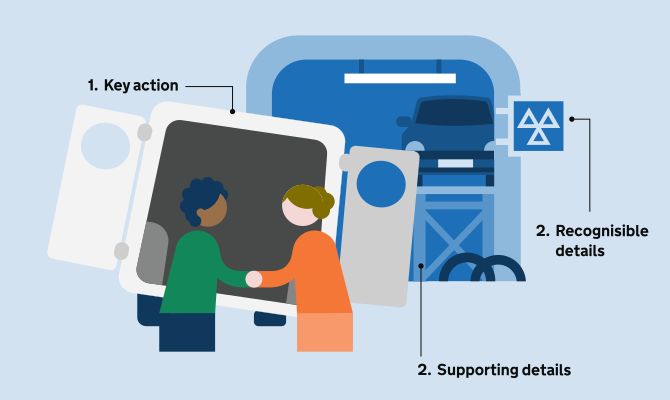
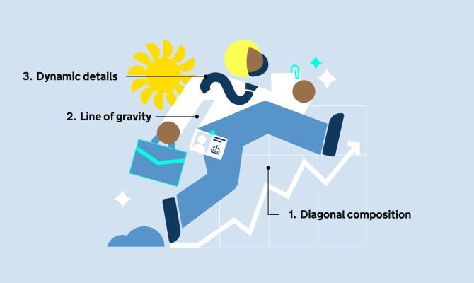

## Techniques to help communicate a scene

When laying out a scene, use these techniques to help communicate emotion, action, and narrative clearly. They can be applied to both simple and more detailed illustrations, helping to keep compositions focused, dynamic, and easy to read.

### Building composition

1. Overlaps: position objects on top of each other with slight overlaps to create a sense of depth and keep the image clear.

2. Negative space: use blank or single-coloured areas to help keep the composition focused and balanced.

3. Framing: use larger overarching shapes, such as a window or a doorway, or the shape of the chat bubble in this example to frame the central action and guide the viewer’s focus.

### Adding detail

1. Prioritise the key action: ensure secondary details never obstruct the primary key action that you’re communicating or disrupt the visual hierarchy of the composition.

2. Recognisable details: use details to ground the scene in a specific environment, such as the MOT sign, that indicates this is a UK mechanic.

3. Supporting elements: incorporate subtle background details, like the car on the car lift, this provides extra context and depth in this example

### Movement

1. Utilise diagonal composition: create energy and momentum by tilting figures and elements along a diagonal axis rather than using static, upright postures.

2. Define a “line of gravity”: it should reflect the emotion of your character and help add a sense of movement.

3. Dynamic details: add secondary objects that match the flow of the composition.

Match the level of movement and expression to the emotion and meaning that the illustration is seeking to convey.
