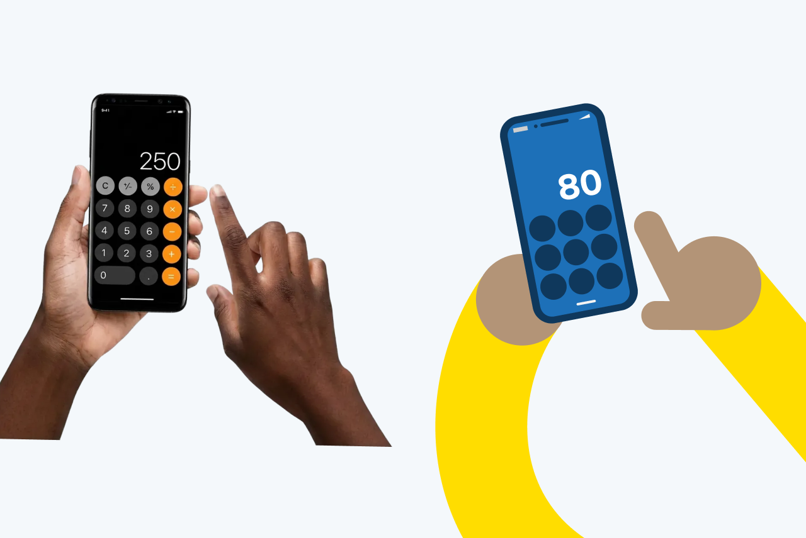
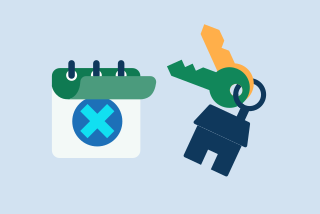
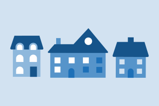

When creating objects and props use real-life reference images as a starting point and simplify them into clear geometric forms to communicate narrative and context effectively.

## Illustrating objects and props



### Real life images

Use real life reference photos and minimal detail and where possible, less is more.

Break down objects into geometric components and/or simple shapes.

### Create a narrative

Suggest a narrative by layering symbols to build meaning. For example, placing an upward arrow inside a toolbox can imply productivity.

### Standalone objects

Use standalone objects and items, or create a simple context for them, for example a calendar page being turned.

### Perspective

Maintain a flat aesthetic, using stylised perspective only when a flat view reduces clarity. In this image, depth is suggested through different shades of blue from our palette to show a ballot paper being placed into a ballot box.

### Buildings and landscapes

Maintain authenticity by basing buildings on photographic references of real, diverse UK structures, depicted with squares, dots and with minimal detail.


