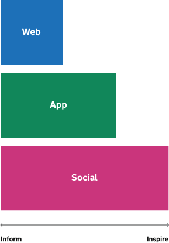

## Brand ambition

Since our launch in 2012, GOV.UK has become one of the most recognisable and trusted online destinations in the UK.
As we increase the number of places that people meet GOV.UK, such as in people's social feeds, and launch more personalised services like the GOV.UK app, we need our brand identity to do more. It needs to be able to compete for attention in busy environments like social media, be equipped to come to life when used in formats including video, while remaining approachable and welcoming for all the people we serve.

The updated GOV.UK identity has been designed with this in mind. It builds on our recognisable and trusted foundations whilst introducing new elements so we can thrive in the broader range of channels that people expect us in today and tomorrow.

## A brand that can inform and inspire

The evolved brand is designed to adapt its tone, visuals and motion for different channels, formats and audiences. We call this the ‘inform to inspire’ scale.

On social media, we aim to capture attention and prompt action. On the web, the focus is on helping people find what they need from government services and act.

The brand can also shift depending on what we're saying. For sensitive topics, we use a more muted and reserved style. For positive content, we can look brighter and bolder.

This flexibility comes from how we use key brand elements – the wider colour palette, the dot and our motion language. What follows shows how to apply the brand in different contexts to meet the needs of people using GOV.UK every day.

