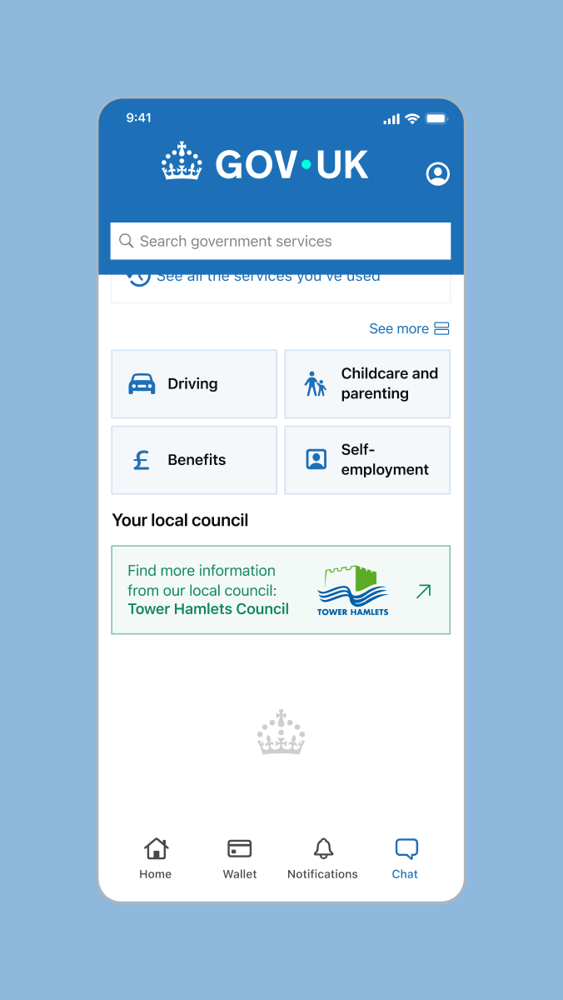

## App logo system

In GOV.UK apps we follow the primary logo system, using the wordmark as the main identifier whilst incorporating the crown as a supporting element to aid trust and recognition.

An example of this is the GOV.UK app icon.




### Wordmark

### Crown

### App icon




An exception to this principle includes other GOV.UK apps, where the symbol or identifier may be used instead of the crown within the app icon. See the [App icon suite section on this page](#app-icon-suite).



## Logo elements within the app

We always lead with the wordmark as our primary brand identifier - positioning it in a prominent position.

We use the crown as a supporting element that sits below or at the end of content.

The examples of logo elements within the app are indicative examples for illustrative purposes only.



### App splash screen

<video src="/graphic-device/dot-use-examples/splash-screen-short-version.mp4" controls width="720" style="max-width: 100%"></video>

<!-- TODO: not sure if this should be the short or long version (both files are in the folder) -->

### Crown watermark




## App icon

The GOV.UK app icon should follow the same principle, leading with the wordmark and using the crown as a supporting element.

As this is a small use application of the logo elements, we use the enlarged crown size to maximise legibility and recognition.




 




### App icon suite

As the family of GOV.UK applications grows, the need for a consistent approach to app icon design is necessary.

The suite of icons should follow the same principles, leading with the GOV.UK wordmark for recognition, with the symbol below, replacing the crown. 



An example of this is the GOV.UK One Login app.



<figure class="flex-center">

<figcaption>Framework</figcaption>

</figure>

<figure class="flex-center">

<figcaption>Example 1: GOV.UK app</figcaption>
</figure>

<figure class="flex-center">

<figcaption>Example 2: GOV.UK One Login</figcaption>

</figure>



