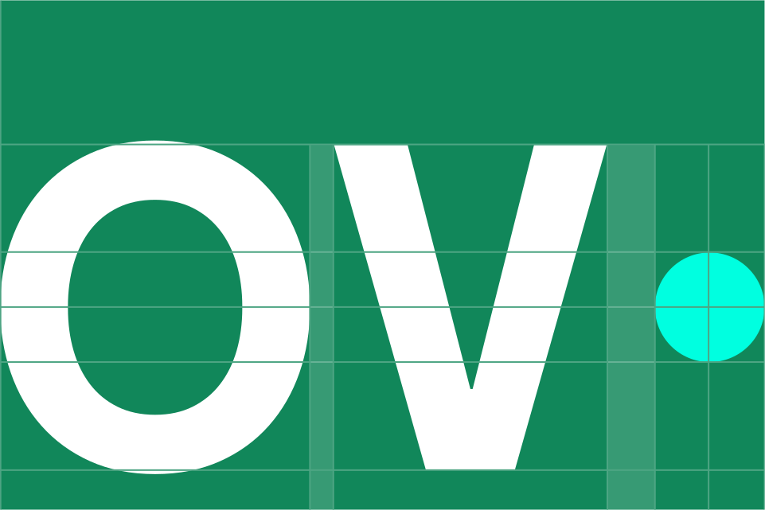

## The GOV.UK logo system

Our logo represents our visual identity at the very highest level and is vitally important to our brand. This guidance will give you the confidence and knowledge you need to use it correctly.

There are two elements to the GOV.UK logo system: the wordmark and crown.

The wordmark is our primary GOV.UK identifier, with the crown being used as a supporting element to indicate trust.




### Wordmark

Our wordmark is our primary identifier and should be used as the lead asset on touchpoints such as the app splash screen and video end frames.

### Crown

The crown must always be present but is used as a supporting asset within close proximity to the wordmark.

### Lock-up

To aid recognition the lock-up combines the crown and wordmark and is used primarily within the web channel.



