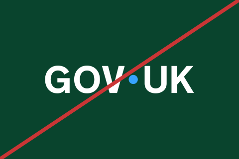

## Social logo system

Within GOV.UK social channels we follow the primary logo system, using the wordmark as the main identifier whilst incorporating the crown as a supporting element to aid trust and recognition.

An example of this is in profile icons.


 ### Wordmark

    


 ### Crown

    


 ### Profile icons

    




## Logo elements within social



We always lead with the wordmark as our primary brand identifier – positioning it in a prominent position.

We use the crown as a supporting element that sits below or to the right of the wordmark, or at the end of content.

 




Indicative examples for illustrative purposes only.






## Social end frames

Social end frames can be used at the end of animated or filmed content. They incorporate both the wordmark and crown and act as a branded sign-off.

### Video end frame 16:9





### Video end frame 9:16



### Video end frame 1:1





## Adaptive dot colour

At times, our social content will need greater impact. One of the ways this can be achieved is through the use of colour.

Our logo follows the adaptive dot colour principle, which allows the dot to change colour depending on the background. This must always follow the tonal range of a colour.

The adaptive dot colour should be reserved for moments where the brand requires more expression, and should not be used in communications that require a more somber or serious tone.

For example, if using Purple Shade 50% as a background, the dot colour would become the Accent Purple.

This can be applied within the live artwork files using the relevant swatches. Always consider accessibility when making these changes.

To aid brand recognition and coherency, adaptive dot colour should not be used within video end frames.



    
    
    
    
    
    
    
    
    
    
    
    
    
    
    
    
    
    



### Incorrect adaptive dot colour usage



Do not use colour combinations that are not accessible.



 



Do not use colour combinations that lack contrast between the wordmark and dot.



 



Do not use colour combinations that are not from the same tonal range.



 



