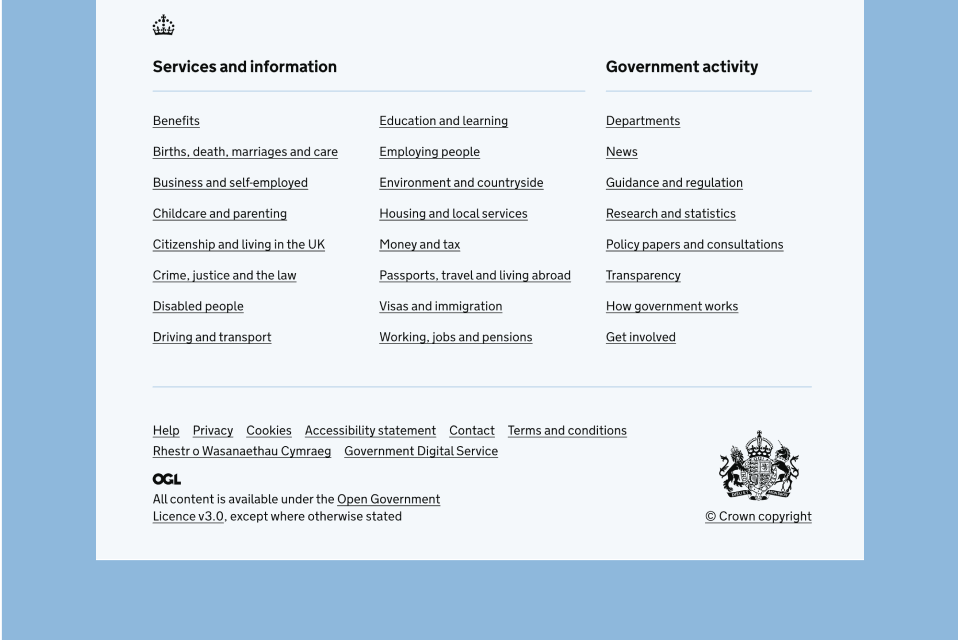

## Web use lock-up

To aid recognition and trust we retain the locked-up version of the crown and wordmark on web.





## Header and footer

The lock-up combining the crown and wordmark is for use throughout the web experience, in moments such as the web header and footer.

The examples on this page are indicative and for illustrative purposes only.

## Footer



<!-- TODO: There is no text in the PDF but should have something here -->



## Favicon

In line with minimum size guidance, within web favicons we use the simplified crown. This is to retain legibility and brand recognition and small sizes.




