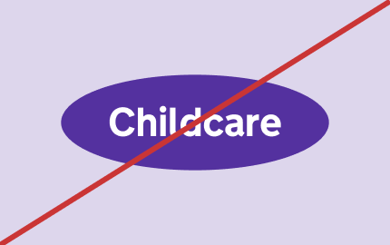
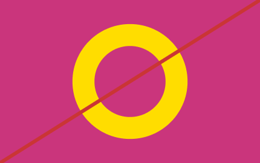
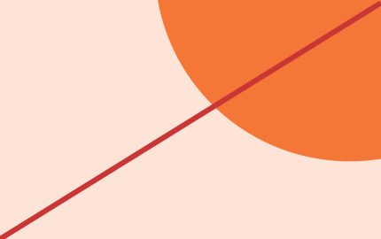
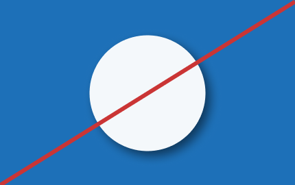

# Incorrect usage

## Incorrect dot usage

The dot has defined roles and behaviours, set out earlier in this guidance. To keep things consistent, avoid the following: 

### Overuse

Dot not overuse the dot

### Decorative elements

Dot not use the dot in a decorative way

### Distortions

Do not distort or skew the dot

### Stroke

Do not use stroke versions of the dot

### Crops

Do not use abstract crops of the dot

### Unapproved filters and effects

Do not apply shadows or gradients

