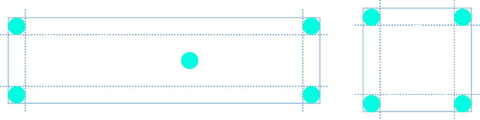

# Logo elements

There are two elements to the GOV.UK logo system; the wordmark and crown. The wordmark is our primary GOV.UK identifier, with the crown being used as a supporting element to indicate trust.

<!--
Not sure how the next section can be made a heading if the same heading is following very soon after.
Maybe it should just be a figcaption?
Or can it be restructured that e.g. everything 'Wordmark' comes under one single heading?
-->

**Wordmark**

Our wordmark is our primary identifier and should be used as the lead asset on touchpoints such as the app splash screen and video end frames.

**Crown**

The crown must always be present but is used as a supporting asset within close proximity to the wordmark.

**Lock-up**

To aid recognition the lock-up combines the crown and wordmark and is used primarily within the web channel.

TODO: missing image

## Wordmark

Our wordmark has been redrawn, elevating the dot into a position that signifies the connection between government and the UK.

TODO: missing image

As our primary identifier, the GOV.UK wordmark should be used in all applications of the logo.

The exception to this rule is the GOV.UK website. See the Web Logo section (3.3) for more details.

## Crown

As our primary identifier, the GOV.UK wordmark should be used in all applications of the logo.

The exception to this rule is the GOV.UK website. See the Web Logo section (3.3) for more details.

### Using the crown as a supporting element

A lock-up system where we can position the crown in close proximity to the GOV.UK wordmark to offer greater flexibility when designing in a wider range of formats and channels.

## Lock-up

The elements that make up our logo lock-up are all scaled using the dot from within the crown.

The spacing between the crown and the wordmark is 3 dots, and the dot within the wordmark is 2 dots in width.

Pixel size displayed here is indicative and will vary across devices.Please refer to platform teams for exact pixel sizes.

This ensures visual balance and harmony between the elements.

<section class="app-section--blue">

### Use proportional scaling

In order to maintain visual hierarchy, consistency and balance between the two elements, scaling of the crown should be proportional to the wordmark.

The size of the crown can be adjusted depending on context. For example, when being used at smaller sizes such as within the app icon, the enlarged crown should be used to aid accessibility and legibility.

<figure>

<figcaption><strong>Standard crown size</strong> Wordmark dot = 2x crown dot</figcaption>

</figure>

<figure>

<figcaption><strong>Enlarged crown size</strong> Wordmark dot = 1x crown dot</figcaption>

</figure>

</section>

### Maintain clear space around logo elements

Maintaining clear space around the logo is essential to ensure its visibility, impact, and legibility. By respecting clear space guidelines, we preserve the logo’s integrity and ensure it remains a strong and recognisable brand asset.

The clear space area is defined by the dot size within our wordmark.

TODO: missing image with space around crown

<section class="">

## Minimum sizing

Keeping the logo at its minimum size helps ensure it stays legible and accessible. If it’s too small, it can lose detail and be harder for some users to read or recognise.

<!-- TODO: suggest adding the arrow to the image -->

<figure>

<figcaption>Minimum width: 50px</figcaption>

</figure>

<figure>

<figcaption>Minimum width: 16px</figcaption>
</figure>

<figure class="app-grid-cell" style="--app-grid-cell-span: 2">

<figcaption>Use the small crown version for anything below the crown’s minimum size, such as web favicons.</figcaption>
</figure>

</section>

## Logo colour

### Primary Blue background

When using on a Primary Blue background, the wordmark colour should use White and Accent Teal.

### Light background

When using against a light background, the wordmark colour should use Black and Primary Blue.

### Special use

When using against a busy background or in print situations where colour isn’t possible, white or black versions of the wordmark can be used.

<!-- TODO: the logo-special-dark needs to be extracted as an SVG -->

## In motion

Both logo elements have a standalone animation that can be used to add dynamism to the brand.

### Wordmark

### Crown

## Incorrect usage

To maintain consistency across channels the logo elements should never be changed or altered.

Do not alter colour balance within the wordmark

Do not distort, stretch or skew the wordmark

Do not apply drop shadows or effects to the wordmark

Do not use the wordmark on overly busy or low-contrast backgrounds

Do not flip, mirror, or rotate the wordmark
