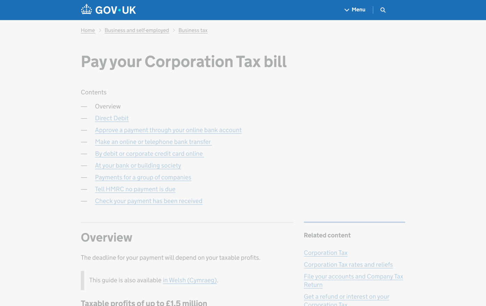
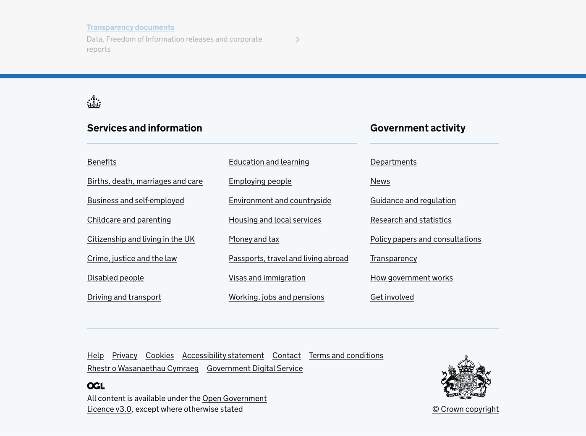
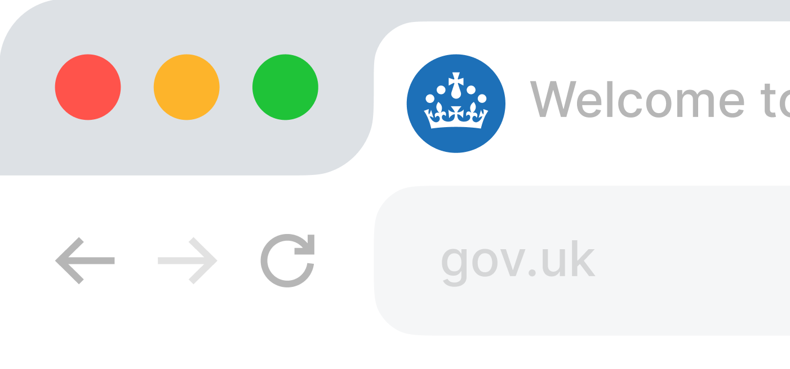

# Web

## Web use lock-up

To aid recognition and trust we retain the locked-up version of the crown and wordmark on web.

<!--
TODO:
- shouldn't be referencing file in other folder
- it's probably not the correct file either
-->

## Header

The lock-up combining the crown and wordmark is for use throughout the web experience, in moments such as the web header and footer.

Indicative examples for illustrative purposes only.

## Footer

<!-- TODO: There is no text in the PDF but should have something here -->

Indicative examples for illustrative purposes only.

## Favicon

In line with minimum size guidance, within web favicons we use the simplified crown. This is to retain legibility and brand recognition and small sizes.

Indicative examples for illustrative purposes only.
