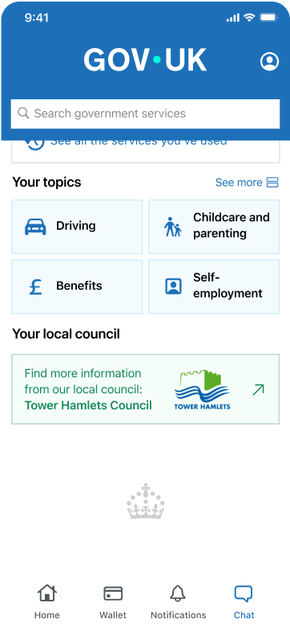

# App

## App logo system

In GOV.UK apps we follow the primary logo system, using the wordmark as the main identifier whilst incorporating the crown as a supporting element to aid trust and recognition.

An exception to this principle includes other GOV.UK apps, where the symbol or identifier may be used instead of the crown within the app icon. For more guidance on this see the ‘App icon suite’ page within section 3.4.

### Wordmark

### Crown

### App icon

## Logo elements within the app

We always lead with the wordmark as our primary brand identifier - positioning it in a prominent position.

We use the crown as a supporting element that sits below or at the end of content.

### App splash screen

<!--
TODO:
- gif has transparent background but should be blue
- not sure if this should be the short or long version
-->

### Crown watermark

Indicative examples for illustrative purposes only.

## App icon

The GOV.UK app icon should follow the same principle, leading with the wordmark and using the crown as a supporting element.

As this is a small use application of the logo elements, we use the enlarged crown size to maximise legibility and recognition.

### App icon suite

As the family of GOV.UK applications grows, the need for a consistent approach to app icon design is necessary.

The suite of icons should follow the same principles, leading with the GOV.UK wordmark for recognition, with the symbol below, replacing the crown.

Example of the GOV.UK One Login app as shown here.

Framework

Example 1: GOV.UK app

Example 2: GOV.UK One Login

