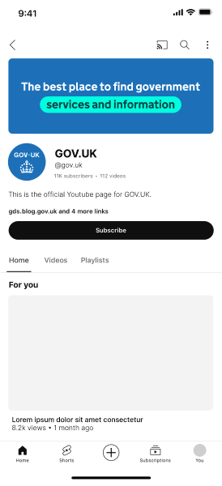
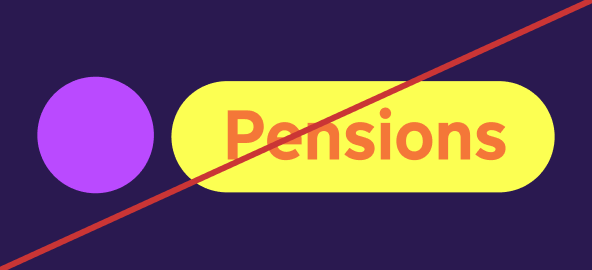

# Palette overview

Our palette consists of 4 tiers;
Primary, Tints, Shades and Accents.

<!-- Same problem as before: We should use headings but cannot use H2s here -->

**Primary**

Primary colours form the foundation of the brand palette, with blue as the core colour that anchors the visual identity. The additional primary colours are complementary and can be used to express tone, emphasis, or differentiation while maintaining brand cohesion. These colours should be applied thoughtfully to reinforce consistency and clarity across all communications.

**Tints**

Tints are lighter variations of the primary colours, created by adding white. These are useful for backgrounds, highlights, and creating a sense of space while maintaining brand coherence.

**Shades**

Shades are darker variations of the primary colours, created by adding black. They provide depth, contrast, and are ideal for text or design elements requiring emphasis.

**Accents**

Accents are supplementary colours used sparingly to highlight important content, inject energy, or signal specific actions or statuses within a design. They should complement the primary palette without overwhelming it.

## Coherency across channels

We lead with the Primary Blue and Accent Teal across all GOV.UK channels. From the blue header on web and app, to branded banners within social platforms, this aids brand recognition and establishes trust.

### Mobile web header

### App splash screen

<!-- TODO: using file from different folder
           also, not sure if it should be ...-long.gif or ...-short.gif -->

### App header

### YouTube profile

Indicative examples for illustrative purposes only.

## Colour accessibility

You must make sure that the contrast ratio of colours used meets [Web Content Accessibility Guidelines (WCAG 2.2) success criterion 1.4.3 Contrast (minimum) level AA](https://www.w3.org/TR/WCAG22/#contrast-minimum).

TODO: missing image

## Incorrect colour usage

To maintain consistency across channels the colours within our palette should never be changed or altered. Exceptions to the recommendations below must be approved by the brand team.

Do not use colour combinations that do not meet [WCAG2.2 guidelines](https://www.w3.org/TR/WCAG22/#contrast-minimum)

Do not create new colours

Do not use too many colours within an application

Do not mix colours to create gradients (single colour gradients are permitted for use over imagery)

Indicative examples for illustrative purposes only.

## Tailoring for GOV.UK channels

Each GOV.UK channel requires a different level of function and expression and therefore the palette has been tailored accordingly.

The following guidance details which palette can be used across web, app and social.

