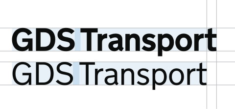
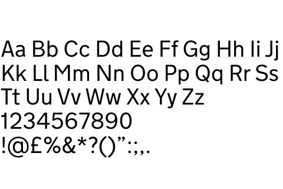
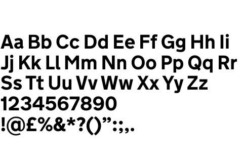

Typography is a core element to our identity, shaping how our brand is perceived across all GOV.UK channels.

This section outlines the correct application of typography throughout our channels. Providing guidance on weight, scale, hierarchy and alternatives for when our primary typeface is not available.

## GDS Transport

We use GDS Transport as the typeface for GOV.UK.

It’s based on the typeface designed in the 1960s by Jock Kinneir and Margaret Calvert for UK road signs. That design was made to be clear and readable for drivers travelling at high speeds.

The Government Digital Service adapted it in 2012 for digital use, bringing the same clarity and people-first approach to government websites.


Using GDS Transport makes GOV.UK easier to recognise and information easier to read on any device.



### Weights

GDS Transport consists of two weights: light and bold.

### Glyphs

GDS Transport offers a wide range of glyph support. It includes a comprehensive selection of letters, numerals, punctuation, and special symbols, making it suitable for various levels of communications.



GDS Transport Light

GDS Transport Bold


