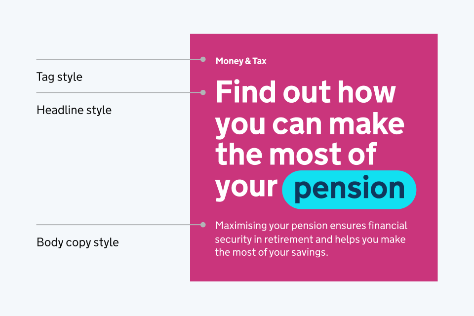
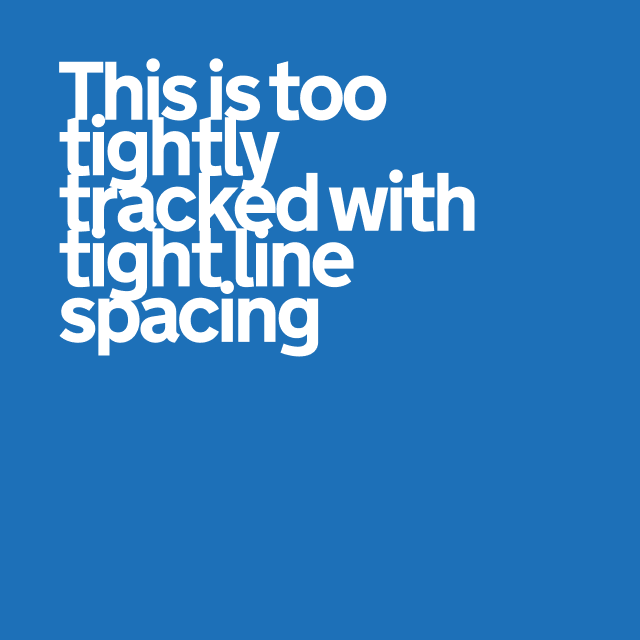

## GDS Transport and social media

GDS Transport is our primary brand typeface.

Using it within our social channels can provide significant advantages, particularly in strengthening brand recognition and creating a cohesive user experience across platforms and channels.



Whilst there may be cases where it is not possible, we should always try to use GDS Transport where possible.

<!-- TODO: image is duplicated in ../app/ -->



## Building visual hierarchy

Type hierarchy is key to creating content that is readable and easy to follow.

Whilst there are many ways to build visual hierarchy, mixing weight and scale across tags, headlines and body copy is a simple yet effective approach.


Indicative examples for illustrative purposes only.






## Styles

Consistent use of type styles aids clarity and hierarchy.

Headings should be attention-grabbing, whilst body text should prioritize readability with appropriate line spacing and contrast.

<!-- TODO: lots to do here, some of the below should probably be in images -->



### Headline styles

Bold, over a maximum 5 lines
Light, over a maximum 5 lines
Any content over 5 lines should be formatted as a body style

img goes here

### Body copy styles

Body copy styles should always be set in Light and should be used for all longer form content.

img goes here

### Tags styles

Tags should be set in Bold, but to aid hierarchy should be a smaller type size than body copy.

img goes here



## Alignment

<!-- TODO: the next two headings started with a small image that is not in here yet
           but we might not need it for consistency reasons? -->


Indicative examples for illustrative purposes only.




### Left aligned text

Where possible we should lead with left-aligned text.

It improves readability by keeping spacing consistent and reducing eye strain.

It prevents uneven gaps (rivers of white space) found in fully justified text, making it easier to follow, especially for users with dyslexia or visual impairments.

### Centre aligned text

Centred text should be used sparingly for shorter headlines, predominantly within social channels.

Whilst it grabs attention, it reduces readability in longer text, making it harder for the eye to track.



## Type settings

Type settings are essential for both accessibility and brand consistency. Well-structured typography improves readability, ensuring that content is clear and easy to understand for all users.

Consistent application of font sizes, line height, and letter spacing creates a cohesive visual experience across all content types.

Depending on the size of type, different settings should be applied, as illustrated here.


Indicative examples for illustrative purposes only.




**Do** use consistent and clear line and letter spacing.

**Don't** use line and letter spacing that is too wide or tight.

 



## Fallback fonts

There will be occasions where GDS Transport is not available for use, such as within certain apps or platforms.

Where standard system fonts are available, Helvetica Neue or Arial should be used.



In cases where system fonts are unavailable, the closest replacement should be used.

This should always be a sans serif, low contrast typeface with a focus on accessibility.


