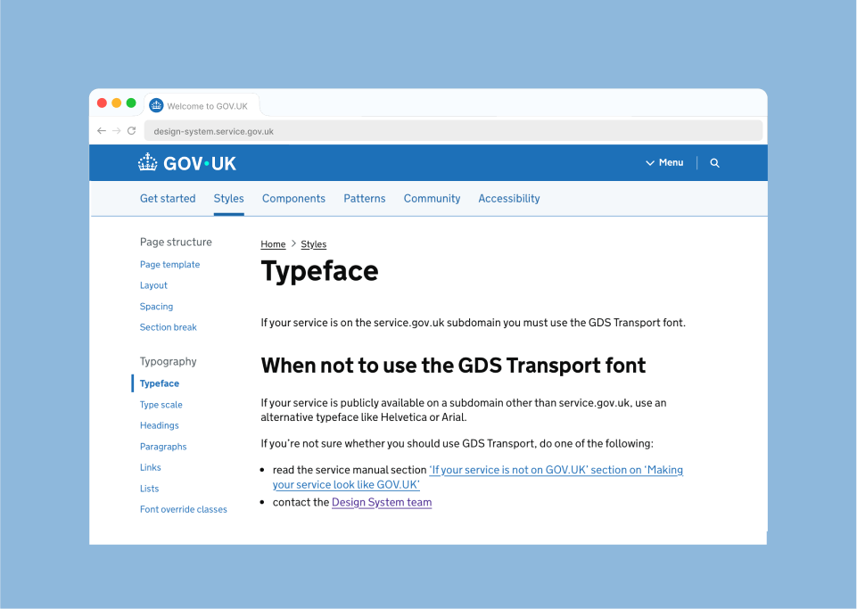

## Design System guidelines

If your service is on the service.gov.uk subdomain you must use the GDS Transport font.



For in depth guidance on how to correctly apply typography within the web channel, refer to the guidelines on the [GOV.UK Design System](https://design-system.service.gov.uk/styles/typeface/).


