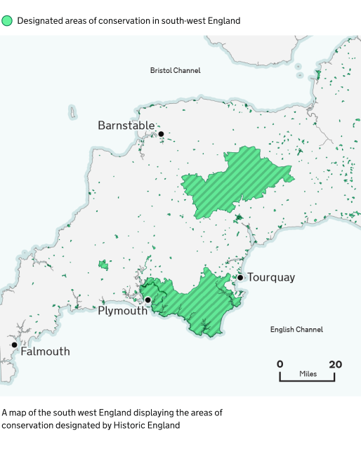

## Elements of a map

A well designed map can bring data to life.
They can show geographical trends and patterns.

### Titles

All charts need at least one title, but it is considered best practice to give them two – a headline title and a formal statistical subtitle.

Titles should be:

- front-loaded
- in the active voice
- in sentence case
- describing the main trend
- as concise as possible

Subtitles should include the:

- statistical measure
- geographic coverage
- time-period

### Labels

If showing administrative boundaries, annotate them directly on the map or identify the boundary in the legend.

If only showing one or two features, we recommend labelling directly on the map.

This approach enables you to forgo the legend and free up space for other features.

### Geographical features

Map features are the elements of a map that provide geographic context for the main data you’re showing. From bodies of water, terrain or boundaries, they help users understand where things are and how they relate to each other.
Keep your map simple. Remove any features that aren’t essential to the map’s message, like towns, roads, rivers, railways, pipelines or regional and country labels. If they don't add to the story or provide context to a user’s experience, feel free to leave them out.

### Source and Legend

You should give the specific data source for each chart and link directly to it if you can.

It is best practice to provide source information in the following format: [publication, survey or other source of data] from the [organisation]

Create a legend to help make the map clearer and reduce clutter. Place it in the top left corner, where people typically look first, and avoid overlapping features. Organise the legend from the most important data to the least important for easy understanding.

## Map considerations

A well designed map is a result of taking account of the considerations.

### Hierarchy

Ensure the story pops to the foreground. The main story elements should be hierarchically prominent. Use bold colours and larger font/symbol size on these elements.

Secondary features should fall to the background and not be as immediately present. Ensure there is enough contrast between background elements and other features.

### Remove extraneous features

Less is more. If features are not part of a story, feel free to remove (ex. roads, rivers, rails, pipelines, and even country labels). Feel free to thin out networks of line work or remove features that are not part of a story, such as roads, rivers, rails, pipelines, and even country labels.

### Projections

Map projection parameters should strive to centre the focus area without bringing it too close to the neatline (the edge of the map).

Ask yourself: What is the map’s purpose and what is the best type of projection to depict it? What geographic extent will sufficiently support the spatial distribution of the story at the appropriate scale?

### Visualising scale

Scale bars are not always needed on a map, but are often helpful. If a map has anything to do with distance or shows features that a consumer would be curious how far apart they are, add a scale bar. If measuring distance is not helpful for the reader to understand the story, do not include one.

Scale are not always appropriate on all map projections (e.g., Orthographic and Robinson). At global map extents for instance, scale bars are not as useful as the scale may vary significantly from one part of the map to another.

## Map palette

Use colour thoughtfully in maps, choose a clear palette, limit colours, and ensure a 3:1 contrast ratio. Check for colour-blind accessibility and include a legend.
Combine colour with shapes, patterns, and labels to improve clarity.

Be aware that users may interpret colours differently, influenced by cultural or political associations.

### Blues



### Magentas



### Reds



### Greens



### Purples



### Teals



### Oranges



### Neutrals



## Using colour combinations on maps

Avoid using colour alone to convey information in a map, instead use colour in combination with:

- using different shapes and symbols
- differentiating size and thickness of lines or shapes
- using labels
- creating a legend (‘key’) to explain what colours, tints and patterns mean

When you choose colours for a map, think about how they help users understand the information. The colours need to be clear, logical, and accessible.

Use colours that make sense to your users, and make sure there’s enough contrast between them. Text should also have strong contrast against the background so it’s easy to read.

Don’t assume everyone sees colours the same way. Colour meanings can change depending on culture or context. For example, some colours are linked to political parties in the UK. Always test your map with users to check how they understand the colours.

If you can’t get enough contrast, try breaking the map into simpler versions, adding outlines to separate areas, or giving the same information in a different format, like written content or a postcode tool.

### Example

<!--
TODO: image asset is still missing, the below is only a quick screenshot
-->

A map of the South West England displaying the areas of conservation designated by Historic England

Indicative examples for illustrative purposes only.

### Colours used in example

{% set mapExampleColours = [
  { label: "Accent Green", hex: "#66F39E", group: "poi" },
  { label: "Primary Green", hex: "#11875A", group: "poi" },
  { label: "Black", hex: "#0B0C0C", group: "poi" },
  { label: "Black Tint 80%", hex: "#CECECE", group: "base" },
  { label: "Black Tint 95%", hex: "#F3F3F3", group: "base" },
  { label: "Teal Tint 80%", hex: "#D0E6E7", group: "base" },
  { label: "Teal Tint 95%", hex: "#F3F9F9", group: "base" }
] %}

#### Points of interest to the user

Data, data outline, labels

<!-- TODO: these three titles should be extra labels on the swatch items
           but that functionality is not availabable yet -->



#### Base map

Land outline, land, coastal areas, sea

<!-- TODO: these four titles should be extra labels on the swatch items
           but that functionality is not availabable yet -->


